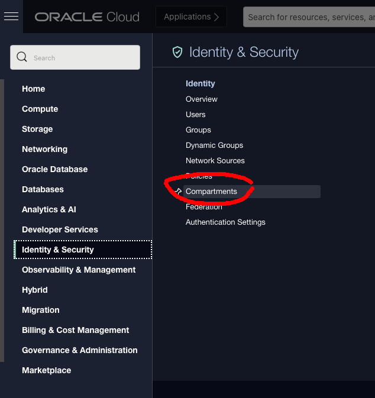
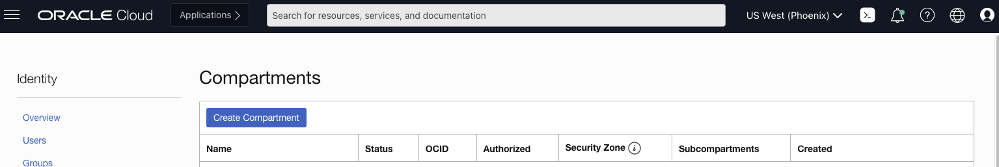
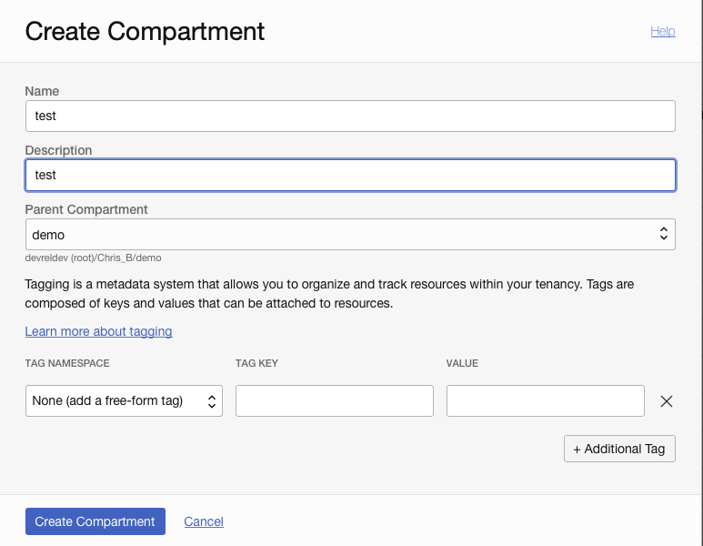

## Create a Oracle Cloud Compartment

By Chris Bensen

If you prefer you can read this blog post on GitHub [here](TODO).

A [Compartment](https://docs.cloud.oracle.com/iaas/Content/Identity/Tasks/managingcompartments.htm) is useful when you want to organize and isolate your cloud resources. This is the same reason you have boxes and drawers at home or carry things around in a backpack.

This requires an Oracle Cloud account. You can get one for free called the [Free Tier Account](TODO).

1. Click the menu icon in the upper left corner.

1. Scroll to the bottom, under Identity, click "Compartments" (or in the search type Compartments)
   

1. Click "Create Compartment".
   

1. Populate the Name and Description.

1. Leave the parent compartment set to (root), unless you want the compartment to be a sub compartment.

1. Click "Create Compartment"
   

1. Click the "Oracle Cloud" logo to return to the dashboard.
