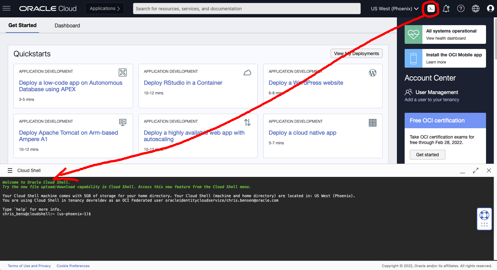
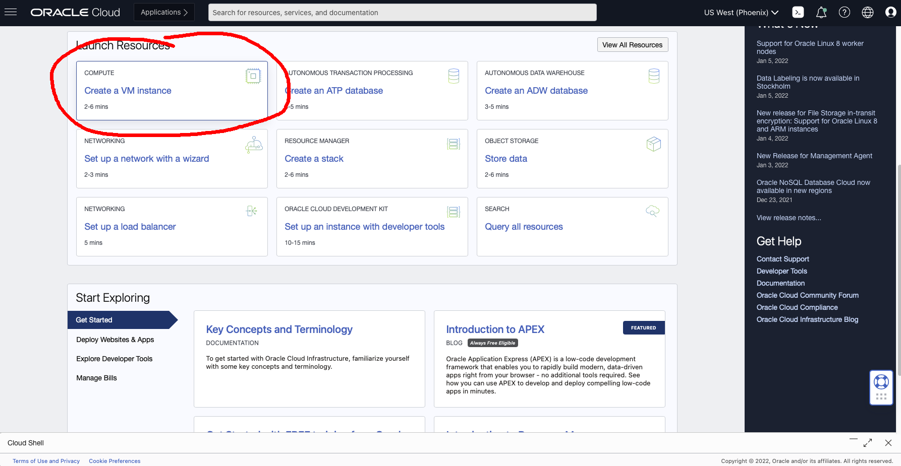
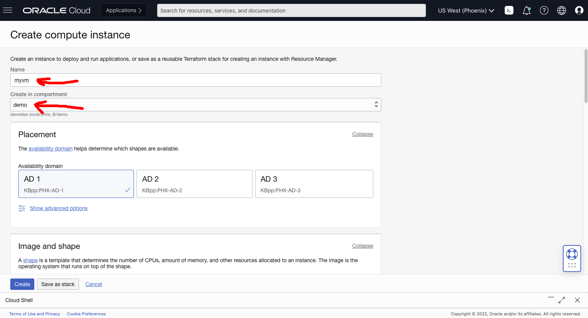
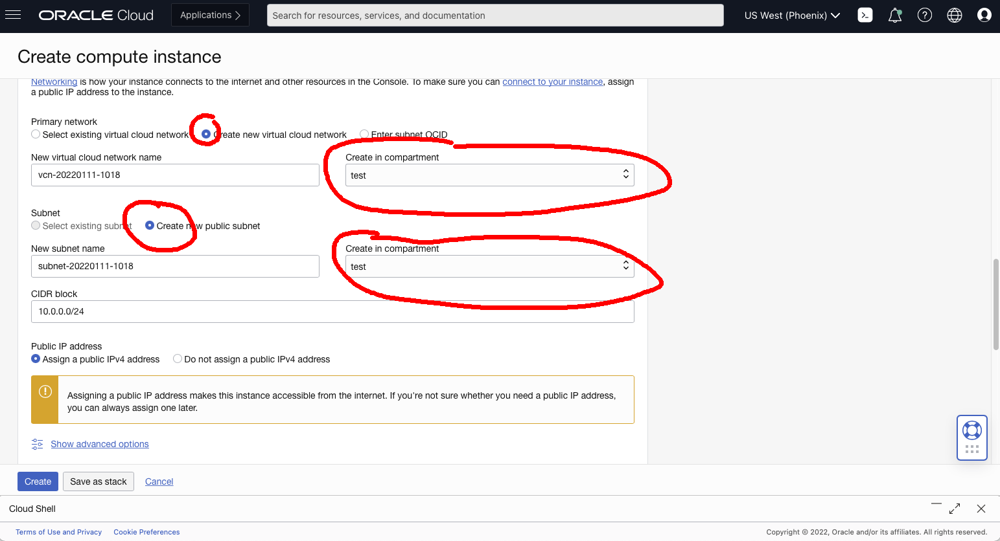
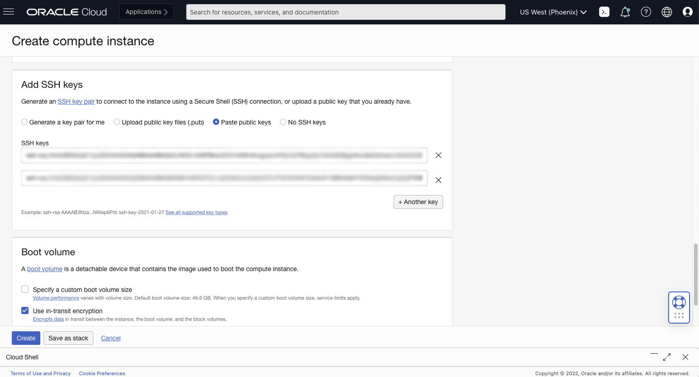
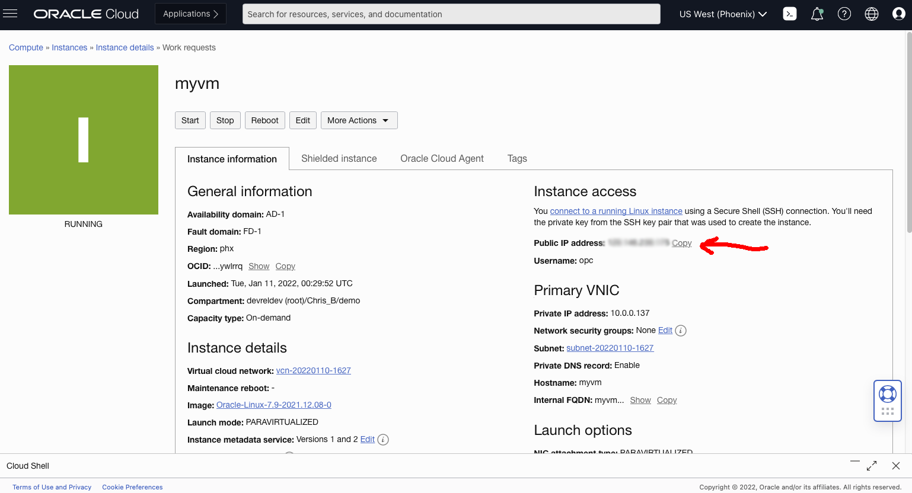

## Create an OCI Compute instance

By Chris Bensen

If you prefer you can read this blog post on Medium [here](TODO).


An Oracle Compute instance is a VM in the cloud you can use as a remote computer to do any task you can imagine; host a personal drop box, share files securily with friends, run a [Minecraft server](https://recursive.codes/blog/post/1946), store weather data in a database, [remote control a car over the internet](https://www.youtube.com/playlist?list=PLPIzp-E1msrZ0WAvm20TkXtm7Hm5JnHxc) the possibilities are endless:


1. First create a [Free Tier Account](https://medium.com/oracledevs/create-an-oracle-always-free-cloud-account-bc6aa82c1397), then come back here and continue these steps.

1. Click the Cloud Shell icon in the upper right corner. This will open a preconfigured VM that you will use to access your instance. Cloud Shell has the OCI command line tools already configured. You can install these tools locally but this is an easy way to do it.
   

1. Generate a new RSA key pair.
   ```
   ssh-keygen -t rsa -N "" -b 2048 -C "cloud_shell" -f ~/.ssh/oci_id_rsa
   ```

1. Display the public key and copy it.
   ```
   cat ~/.ssh/oci_id_rsa.pub
   ```

1. You can now minimize the Cloud Shell window and scroll down a little. Click "Create a VM instance" in the Compute box. We will setup the instance to be accessed from the Cloud Shell and a local Terminal via SSH.
   

1. Populate the name with **myvm** *NOTE* You can choose any name you want by replacing **myvm** with your name throughout this document.
   

1. Change the "Create in compartment" field to the compartment of your choosing. I'm choosing **test** Go here to learn how to [create a compartment](https://chrisbensen.medium.com/create-a-oracle-cloud-compartment-22b090100914).

1. Scroll down to Networking. In this example we will create a new Virtual Cloud Network (VCN). Change the compartment to the same as you choose above.
  

1. Scroll down the the "Add SSH keys" section.

1. Select "Paste SSH keys" and paste in the public SSH key created in the cloud shell earlier.

1. You may want to access this VM instance from your local Terminal, press the “+ Another Key”
   1. From your local Terminal, generate a new RSA key pair.
      ```
      ssh-keygen -t rsa -N "" -b 2048 -C "oci_instance" -f ~/.ssh/oci_id_rsa
      ```

   1. Display the public key and copy it.
      ```
      cat ~/.ssh/oci_id_rsa.pub
      ```

   1. In the **Create Compute form**, paste the public key in the SSH KEYS box.
      
      If you intend to SSH into your instance from any other machine, you may click the "+ Another Key" button and enter the public key for that machine.
      (you may also want to save a copy of the Cloud Shell private key '~/.ssh/id_rsa' on your local machine.)
      **DO NOT SHARE your private key**.  This key allows access to your instance.

1. Click "Create" at the bottom of the screen.

1. Once the instance is running, locate the "Public IP sddress" and click Copy.
Keep this IP address handy, it will be referred to as **\<YourPublicIP>.**

1. In your **Cloud Shell** create an environment variable to store the IP.
   ```
   export INSTANCE_IP=<YourPublicIP>
   ```
   

1. In your local Terminal create an environment variable to store the IP.
   ```
   export INSTANCE_IP=<YourPublicIP>
   ```

1. Use SSH to access your instance.
   You have a choice connect to your instance from Cloud Shell or from your local terminal.
   ```
   ssh -i ~/.ssh/oci_id_rsa opc@${INSTANCE_IP}
   ```

You now have a VM in the cloud with credentials to access that is always running and ready to setup with all your tools.

This requires an Oracle Cloud account. You can get one for free called the [Free Tier Account](https://medium.com/oracledevs/create-an-oracle-always-free-cloud-account-bc6aa82c1397).
