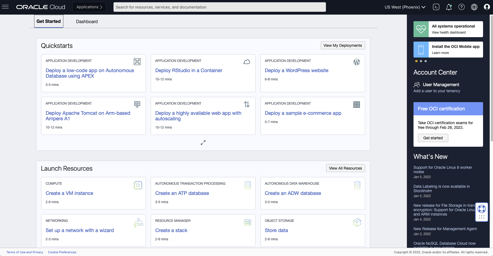

# Create an Oracle Always-Free Cloud Account

By Chris Bensen

If you prefer you can read this blog post on Medium [here](https://medium.com/oracledevs/create-an-oracle-always-free-cloud-account-bc6aa82c1397).

Have you ever wanted to have a server running 24-7 for free! Sorry, that should have been a question. Have you ever wanted to have a server running 24-7 for free? What! Yes, you can setup a Linux server to run for free doing things. Yes things! It will do whatever you want. And it's free! What's the catch? Well, you have to sign up for it and then it takes some work to make it do a thing. But just the other day I shared a file with someone completely securely rather than send it over email. So come up with an idea and sign up for a free account by following these four steps:

1. Go to [https://www.oracle.com/cloud/free](https://www.oracle.com/cloud/free/?source=:so:yt:or:dg:ocorp:::&pcode=WWMK220120P00034)
1. Click "Start for free"
1. Populate the forms and create an account.

   **Note:** Some regions don't have all features. The [matrix of features](https://www.oracle.com/cloud/data-regions/) (this sounds like something from a [Transformer movie](https://en.wikipedia.org/wiki/Transformers_(film))) shows a list of all the feautures available in each region.

1. Once your account is created, [log in](https://www.oracle.com/cloud/sign-in.html) and go to the dashboard.
   

**Note:** To signup you will need a credit card, however it will NEVER be charged UNLESS you upgrade your Free Tier account. You HAVE to change your account to a paid account to be charged.

Now you have a Free Tier account. For a little light reading about your new Oracle Cloud account read some [documentation](https://docs.oracle.com/en-us/iaas/Content/FreeTier/freetier_topic-Always_Free_Resources.htm).
