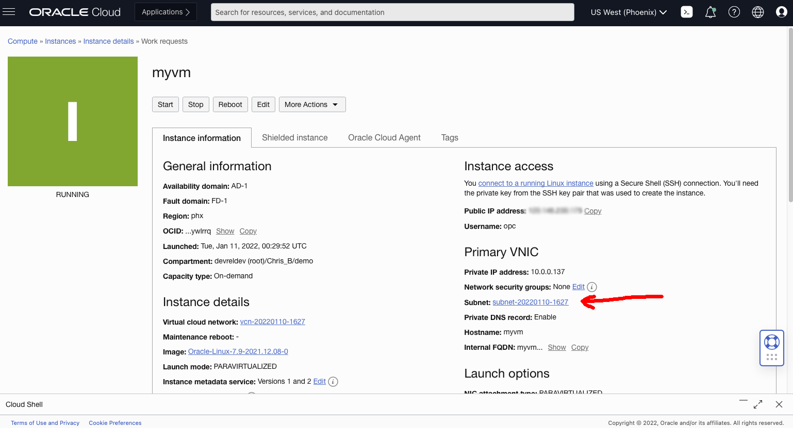
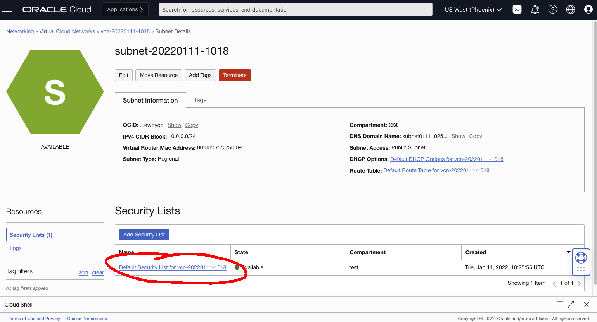
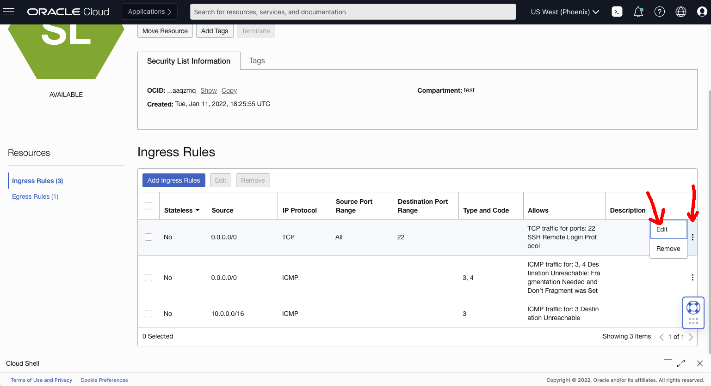

# Allowlist Your IP Address to Security Connect to an OCI Compute Instance

By Chris Bensen

If you prefer you can read this blog post on Medium [here](https://chrisbensen.medium.com/white-list-your-ip-address-to-security-connect-to-an-oci-compute-instance-4fb99958f0d9).


First, some definitions:

A <em><strong>bastion</strong></em> host is the only computer that is a proxy for a secure network.

<em><strong>VPN</strong></em> is a security technology for users to connect to a network securely.

Every time I setup a VM in the cloud with a public IP address, all the security bells go off in my head. As they should. But setting up a bastion or VPN is such a pain. And overkill. Seriously, who has time for that when you're building a weekend hack? So here's a very simple way to allowlist your public IP address so your computer is the only one that can interact with the VM.

## Step 1 - Get an Oracle Free Tier

This requires an Oracle Cloud account. You can get one for free called the [Free Tier Account](https://medium.com/oracledevs/create-an-oracle-always-free-cloud-account-bc6aa82c1397). I'm going to demonstrate how to do this with Oracle Free Tier because, well, it's free! Free for you, forever and ever. Seriously, it's a good deal to get a couple hundred gigs of storage in the cloud and some free processors.

## Step 2 - Create a Compute Instance

Oracle cloud calls a VM "Compute". So create one of those using these steps which will give you an "instance": [Create Compute Instance](https://chrisbensen.medium.com/create-an-oci-compute-instance-493d10e2e6a6)

## Step 3 - Get Uour Router's IP Address

From my blog post [How do I find my router's public IP Address from the command line?](http://chrisbensen.blogspot.com/2021/11/how-do-i-find-my-routers-public-ip.html), open up a local Terminal and run the following command to get your router's IP address and copy it:

```
dig -4 TXT +short o-o.myaddr.l.google.com @ns1.google.com
```

It will be referred to as **\<PersonalIPAddress>**

## Step 4 - Set Up the Security List to Allowlist Your IP Address

Now that you have an instance and your public IP address, follow these steps to allowlist only your computer to access the instance via SSH (port 22).

1. Click the link next to "Subnet" field, this will bring you to the list of Virtual Cloud Networks:

  

1. Click the VCN:

  

1. Click on the "Default Security List":

  

1. Under "Ingress Rules" you can see SSH (port 22) already has a rule. Click the &hellip; on the right hand side and choose edit:

  

	**NOTE:** You can add your own rule by clicking the "Add Ingress Rules" button, but you don't need to do this since it's already created.

1. Fill in the "Source CIDR" with your personal IP Address from step 3 above, with a "/32" at the end to limit it to a single machine:

  ```
  <PersonalIPAddress>/32
  ```

  For example: 1.2.3.4/32

1. Click "Save Changes." You're done.

## Step 5 - Test

From a local Terminal, run the following:

**NOTE:** INSTANCE_IP came from step 2 when creating a Compute:

```
ssh -i ~/.ssh/oci_id_rsa opc@${INSTANCE_IP}
```
