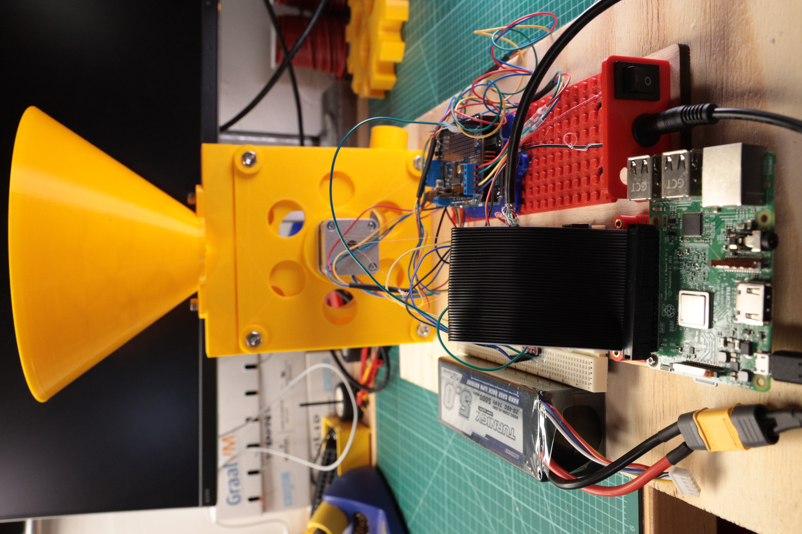

# Weekend Hack: Automated Halloween Candy Dispenser



https://github.com/chrisbensen/weekend-hacks/candy

Halloween is quickly approaching and I need a way to hand out candy from a distance. Introducing the Automated Candy Dispenser! Build and setup the candy dispenser, run a tube from it to where the Trick-Or-Treaders will be holding out their bags, setup a [free compute with Oracle Cloud](https://tinyurl.com/getoraclecloud), and from your phone dispense candy with just the movement of your finger from anywhere. You literally couldn't get any lazier than this on Halloween.

This project has Raspberry Pi, Arduino, stepper motors, 3D printing, Python, REST all glued together with the Oracle Cloud. We also use hot glue.

Note that this is a work in progress and one more thing needs to be created; an agitator or the candy can get stuck. I will be doing that soon but I need to get this published before Halloween so there's time to make your own!

There are three pieces to this project:

1. The Thing - the Automated Candy Dispenser
1. The Server - the REST Server in the cloud
1. Your Phone - the device that loads a web page and has the button to dispense the candy

## The Server

There are a lot of steps here so I'm just going to dig in.

1. Sign up for [free Oracle Cloud](https://tinyurl.com/getoraclecloud)
1. Create a free compute instance

1. Take note of the IP address, from now on I will refer to it as ServerIP. Anytime you see `<ServerIP>` replace it with the server IP address noted here. The following files must have this change made to them: server/index.html and pi/candy.py.

1. Using the menu, click on Virtual Cloud Network and then the VCN that was created.

1. Now click on Security Lists on the left navigation bar for the VCN.

1. Click on the Default Security List.

1. Here you need to open port 80. Click on + Another Ingress Rule and add the following values as shown below:

Source Type: CIDR
Source CIDR: 0.0.0.0/0
IP Protocol: TCP
Source Port Range: All
Destination Port Range: 80
Click on Add Ingress Rules at the bottom.


1. Here you need to open port 80. Click on + Another Ingress Rule and add the following values as shown below:

Source Type: CIDR
Source CIDR: <your personal IP address>/32
IP Protocol: TCP
Source Port Range: All
Click on Add Ingress Rules at the bottom.


1. Open up a local terminal and SSH into the compute instance.

```bash
ssh opc@<ServerIP>
```

1. Create firewall rules to allow access to the ports on which the HTTP server listens.

```bash
sudo firewall-cmd --permanent --zone=public --add-service=http
sudo firewall-cmd --reload
```

1. Setup the environment and clone the code:

pip install requests
git clone https://github.com/oracle-devrel/weekend-hacks.git
cd weekend-hacks/candy/server
sudo python3 server.py&

If you want this to run automatically at boot do this ([from these directions](https://www.thegeekdiary.com/centos-rhel-7-how-to-make-custom-script-to-run-automatically-during-boot/)):

```bash
sudo nano /etc/systemd/system/candy.service
```

Copy this to the contents of the file:

```
[Unit]
Description=Description for sample script goes here
After=network.target

[Service]
Type=simple
ExecStart=/home/opc/candy/weekend-hacks/candy/server/server.py
TimeoutStartSec=0

[Install]
WantedBy=default.target
```

Enable the systemd service unit.

1. Reload the systemd process to consider newly created sample.service OR every time when sample.service gets modified.

```bash
systemctl daemon-reload
```

1. Enable this service to start after reboot automatically.

```bash
systemctl enable sample.service
```

1. Start the service.

```bash
systemctl start sample.service
```

1. Reboot the host to verify whether the scripts are starting as expected during system boot.

```bash
systemctl reboot
```

server.py

```python
#!/usr/bin/python3
from http.server import BaseHTTPRequestHandler, HTTPServer
import time
import json
from socketserver import ThreadingMixIn
import threading
import requests

hostName = "0.0.0.0"
serverPort = 80

speed = 0
status = 'green'
gimme = False

class Handler(BaseHTTPRequestHandler):

    def do_GET(self):
        global status
        global speed
        global gimme

        # curl http://<ServerIP>/index.html
        if self.path == "/":
            print('running server...')

            # Respond with the file contents.
            self.send_response(200)
            self.send_header("Content-type", "text/html")
            self.end_headers()
            content = open('index.html', 'rb').read()
            self.wfile.write(content)

        # curl http://<ServerIP>/candy
        elif self.path.upper() == "/candy".upper():
            self.send_response(200)
            self.send_header("Content-type", "text/html")
            self.end_headers()
            body = {'status': status}
            self.wfile.write(bytes(json.dumps(body), "utf8"))
            gimme = True

        # curl http://<ServerIP>/query
        elif self.path.upper() == "/query".upper():
            self.send_response(200)
            self.send_header("Content-type", "text/html")
            self.end_headers()
            body = {'status': status, 'speed': speed}
            self.wfile.write(bytes(json.dumps(body), "utf8"))

        else:
            self.send_response(404)

        return

    def do_POST(self):
        global speed
        global status
        global gimme

        # refuse to receive non-json content
        if self.headers.get('content-type') != 'application/json':
            self.send_response(400)
            self.end_headers()
            return

        length = int(self.headers.get('content-length'))
        message = json.loads(self.rfile.read(length))

        response = 0
        body = {}

        # curl -X POST -H "Content-Type: application/json" -d '{"speed":5}' http://<ServerIP>/auto
        if self.path.upper() == "/auto".upper():
            response = 200
            body = {'status': 'true'}
            speed = message['speed']
            print(speed)

        # curl -X POST -H "Content-Type: application/json" -d '{"status":"green"}' http://<ServerIP>/whattodo
        elif self.path.upper() == "/whattodo".upper():
            status = message['status']
            response = 200
            body = {'gimme': gimme}
            gimme = False


        self.send_response(response)
        self.send_header("Content-type", "application/json")
        self.end_headers()
        self.wfile.write(bytes(json.dumps(body), "utf8"))

class ThreadedHTTPServer(ThreadingMixIn, HTTPServer):
    """Handle requests in a separate thread."""

if __name__ == "__main__":
    webServer = ThreadedHTTPServer((hostName, serverPort), Handler)
    print("Server started http://%s:%s" % (hostName, serverPort))

    try:
        webServer.serve_forever()
    except KeyboardInterrupt:
        pass

    webServer.server_close()
    print("Server stopped.")
```

## The Thing


To make this head over to [Thingiverse](https://www.thingiverse.com/thing:5030261) to download the STL files, print them with your 3D printer, and get a list of all the parts required.

Parts
- (2) 1/4" x 1/2" bolt
- (4) 1/4" x 3/4" bolt
- (6) 1/4" nut
- (4) M3 x 8 bolt
- (1) Stepper Motor
- (1) Arduino Leonardo/Uno
- (1) Rasbperry Pi 4
- (2) Wood screws (I used threaded inserts and 2 1/4" bolts)
- (1) Adafruit Motor Controller v2
- (1) 13v power supply with 2.1mm barrel jack
- (1) Pololu 5v voltage regulator

Tools
- Hot Glue Gun
- Soldering Iron
- Hex Tool

[Candy Dispenser STL files]()

### Pi

Open up a command prompt and type run the following command:

```bash
sudo raspi-config
```

Go into “Interface Options”
And enable I2C and SPI in each submenu.

Open up a command prompt and type run the following commands:

```bash
sudo apt update sudo apt upgrade
sudo apt install rpi.gpio
sudo restart
```

Open up a command prompt and type run the following commands:

```bash
pip3 install requests
git clone https://github.com/oracle-devrel/weekend-hacks.git
cd weekend-hacks/candy/pi
sudo nano /etc/rc.locally
```

scroll down to the bottom of rc.locally and add the following just before the end.
**Note* Do not forget to add the *&* at the end.

```
sudo python3 /home/pi/weekend-hacks/candy/pi/candy.py &
sudo python3 /home/pi/weekend-hacks/candy/pi/shutdown.py &
```

candy.py

```python
#!/usr/bin/python3
import RPi.GPIO as GPIO
import time
import socket
import requests
import json

outPin = 16

GPIO.setmode(GPIO.BCM)
GPIO.setup(outPin, GPIO.OUT)

time.sleep(2)
GPIO.output(outPin, GPIO.LOW)

GPIO.cleanup()

GPIO.setmode(GPIO.BCM)
GPIO.setup(outPin, GPIO.OUT)

while True:
    time.sleep(1)

    try:
        data = {'status': 'green'}
        headers = {'Content-type': 'application/json'}
        response = requests.post('http://<ServerIP>/whattodo', data = json.dumps(data), headers = headers)
        print(response)

        if response.json()["gimme"] == True:
            print("launch candy")
            GPIO.output(outPin, GPIO.HIGH)
            time.sleep(10)
            GPIO.output(outPin, GPIO.LOW)
            time.sleep(1)
            print('good')
            time.sleep(1)

    except socket.error:
        print("error")


GPIO.cleanup()
```

shutdown.py

```python
#!/usr/bin/python3
import time
import sys
import RPi.GPIO as GPIO
import os


shutdownPin = 25

GPIO.setmode(GPIO.BCM)
GPIO.setup(shutdownPin, GPIO.IN, pull_up_down=GPIO.PUD_UP)

def Shutdown(channel):
    print("Shutting Down")
    time.sleep(5)
    os.system("sudo shutdown -h now")

GPIO.add_event_detect(shutdownPin, GPIO.FALLING, callback=Shutdown, bouncetime=2000)

while True:
    time.sleep(1)
```

https://www.quartoknows.com/page/raspberry-pi-shutdown-button


### Arduino

https://www.instructables.com/Understanding-the-Pull-up-Resistor-With-Arduino/

```cpp
#include <Adafruit_MotorShield.h>
#include <Wire.h>
#include <Servo.h>


int servoPin = 6;
int inPin = 5;

int i2cAddress = 0x8;
Adafruit_MotorShield shield = Adafruit_MotorShield();
Adafruit_StepperMotor *motor = shield.getStepper(200, 2);
Servo servo;


void setup() {
  Serial.begin(9600);

  // pin, min pulse width in microseconds, max pulse width in microseconds
  servo.attach(servoPin, 0, 180);

  // create with the default frequency 1.6KHz
  if (!shield.begin()) {
    Serial.println("Could not find Motor Shield. Check wiring.");
    while (1);
  }

  Serial.println("Motor Shield found.");
  motor->setSpeed(5);  // rpm
  pinMode(inPin, INPUT);
  delay(3000);
  Serial.println("starting");
}

int val = 0;
int steps = 16;

void loop() {
  delay(1000);
  val = digitalRead(inPin);
  if (val == HIGH) {
    Serial.println("on");
    motor->step(steps, FORWARD, MICROSTEP);
  } else {
    Serial.println("off");
  }
}
```


### Wiring


Arduino Pin 5 -> Line Level Hi Rx 1
Adafruit Arduino Motor Controller Hat V2 + -> 5v +
Adafruit Arduino Motor Controller Hat V2 - -> 5v -

5v + -> Motor Controller +
5v - -> Motor Controller -
Motor Controller + -> Arduino + on barrel jack
Motor Controller - -> Arduino - on barrel jack

Pi 3.3v -> Line Level Lo LV
Pi Pin 16 -> Line Level Lo Rx1
Pi Pin 25 -> button pin 1
Pi GND -> button pin 2

Line Level Lo GND -> 5v -
Line Level Hi GND -> 5v -

Voltate Regulator VIN -> 12v +
Voltate Regulator GND -> 12v -
Voltate Regulator OUT -> 5v +
Voltate Regulator GND -> 5v -


## Conclusion

This is a total hack. It gets the job done and is a good example of building a terrible python REST server to control an edge/IoT device running a Pi and Arduino. But it was fun! And that's really all that counts. It also will make a lot of children happy when I put the pipe in a skeleton on Halloween night and climb in to my Jack Skellington costume.

I'm going to continue to evolve and refine this project so stay tuned for mmore...
