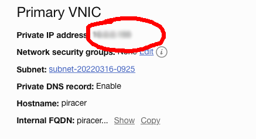

# Create a Personal File Drop

By Chris Bensen


[Photo by Damir Mijailovic from Pexels](https://www.pexels.com/photo/photo-of-water-drop-3587015/)

If you prefer you can read this blog post on Medium [here](TODO).

Have you ever wanted to share a file with someone, but it contained sensitive information? Many people think email is secure, but it isn't. There are services, like DropBox and Google Drive, but who knows what happens with that file after you delete itm as you really don't have full control. Here is a mechanism that I personally use that is ___security through serious obscurity___ and it is a one-time download. Let's get started!

## Prerequisites

1. Set up a [web server](https://medium.com/chrisbensen/create-a-simple-python-web-server-on-oci-1d3634a1d7c2).

Find out more about [Compute](https://docs.oracle.com/en-us/iaas/Content/Compute/home.htm?source=:so:bl:or:awr:odv:::RC_WWMK220120P00034:&SC=:so:bl:or:awr:odv:::RC_WWMK220120P00034:&pcode=WWMK220120P00034) and other [Oracle Cloud documentation](https://docs.oracle.com/en-us/iaas/Content/GSG/Concepts/baremetalintro.htm?source=:so:bl:or:awr:odv:::RC_WWMK220120P00034:&SC=:so:bl:or:awr:odv:::RC_WWMK220120P00034:&pcode=WWMK220120P00034) [here](https://docs.oracle.com/en-us/iaas/Content/GSG/Concepts/baremetalintro.htm?source=:so:bl:or:awr:odv:::RC_WWMK220120P00034:&SC=:so:bl:or:awr:odv:::RC_WWMK220120P00034:&pcode=WWMK220120P00034). For interactive support and community check out Oracle's public [Slack channel](https://oracledevrel.slack.com/join/shared_invite/zt-uffjmwh3-ksmv2ii9YxSkc6IpbokL1g#/shared-invite/email) for developers.

# Set up File Drop

1. Now that you have all the prerequisites set up for a web server, instead of running ``server.py`` we're going to use ``filedrop.py``. Copy ``filedrop.py`` to your Compute instance:

    ```console
    scp vidserver.py opc@${INSTANCE_IP}:/home/opc
    ```

    [filedrop.py](files/filedrop.py)

    ```python
    # Python 3 file drop example
    # Run: python3 server.py
    from http.server import BaseHTTPRequestHandler, HTTPServer
    import time
    import os
    import argparse

    parser = argparse.ArgumentParser(description="File drop.")
    parser.add_argument("ip", type=str)
    parser.add_argument("port", type=int, default=2022)
    parser.add_argument("filename", type=str)
    parser.add_argument("droppath", type=string)
    parser.add_argument("dropname", type=string)
    parser.add_argument("dropvalue", type=string)
    args = parser.parse_args()

    address = (args.ip, args.port)
    filename = args.filename
    droppath = args.droppath
    dropname = args.dropname
    dropvalue = args.dropvalue

    print("IP=" + args.ip)
    print("Port=" + str(args.port))
    if os.path.exists(filename):
  print("Filename=" + filename)
    print("Path=" + droppath)
    print("Name=" + dropname)
    print("Value=" + dropvalue)

    class MyServer(BaseHTTPRequestHandler):
    def do_GET(self):
        self.send_response(200)
        self.send_header("Content-type", "application/octet-stream")
        self.send_header("Content-Disposition", "attachment; filename=" + filename)
        self.end_headers()

        path = self.path
        name = ""
        value = ""

        if '?' in path:
          path, args = path.split('?', 1)
          name, value = args.split('=', 1)

          if path == "/" + droppath and name == dropname and value == dropvalue:
            fo = open(filename, "rb")
            self.wfile.write(fo.read())
            fo.close()
            print("success")

        os.remove(filename)

        print(path, name, value)
        return

if __name__ == "__main__":
    webServer = HTTPServer(address, MyServer)
    print("Server started http://%s:%s" % address)

    try:
        webServer.serve_forever()
    except KeyboardInterrupt:
        pass

    webServer.server_close()
    print("Server stopped.")
    ```

1. Collect a few variables:

    **INSTANCE_IP** - You have this from the web server prerequisite earlier.
    **Port** - You have this from the web server prerequisite earlier.
    **Filename** - This is the file that you want to share.
    **PathToFile** - This is where the file is located on the compute instance.
    **Name** - This is just a random string that you will come up with.
    **Value** - Same as Name above.
    **PrivateIP** - This is the private IP address of your server.

  

1. Copy your file to the compute instance:

    ```console
    scp -i ~/.ssh/oci_id_rsa foo.zip opc@${INSTANCE_IP}:/home/opc
    ```

1. run the server

    ```console
    sudo python3 server.py <PrivateIP> <Port> <Filename> <PathToFile> <Name> <Value> &
    ```

  For example:

    ```console
    scp foo.zip ocp@1.2.3.4:/home/pi
    sudo python3 filedrop.py 1.2.3.4 8100 foo.zip chris knockknock whothat &
    ```

1. From any computer use a web browser and access the url `http://<YourPublicIP>:<Port>/PathToFile?Name=Value` to download the file.

  For Example:

    ```console
    http://<YourPublicIP>:8100/chris/foo.zip?knockknock=whothat
    ```

The file will be downloaded, and then deleted from the VM. If any attempt to access the wrong URL occurs the file will be deleted. Share this URL with whomever you want to download the file. 

What I find gratifying: I can send the URL in pieces and the other person must assemble it correctly, but if they fail the file will be deleted. This can be a pain, so I usually have a phone call if I choose this option. I trust "security through obscurity" in this limited case, but I prefer for it to be as real-time as possible. It's your choice, but thought I'd share because sending confidiential information over email is not a good idea.

If you have any questions or for interactive support and community check out Oracle's public [Slack channel](https://oracledevrel.slack.com/join/shared_invite/zt-uffjmwh3-ksmv2ii9YxSkc6IpbokL1g#/shared-invite/email) for developers.
