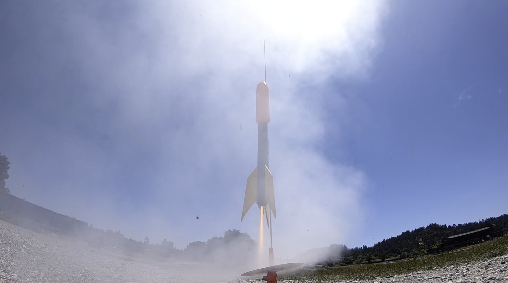
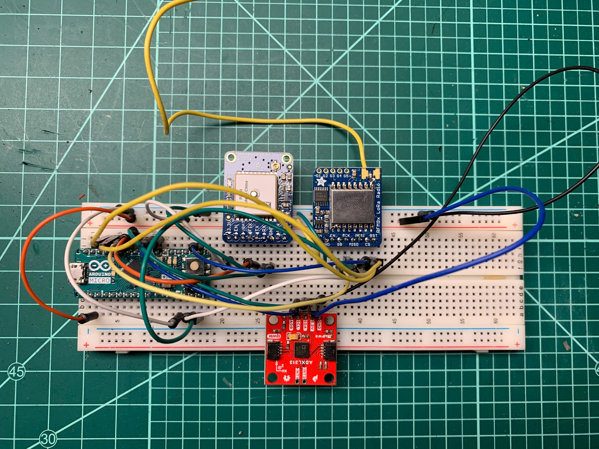
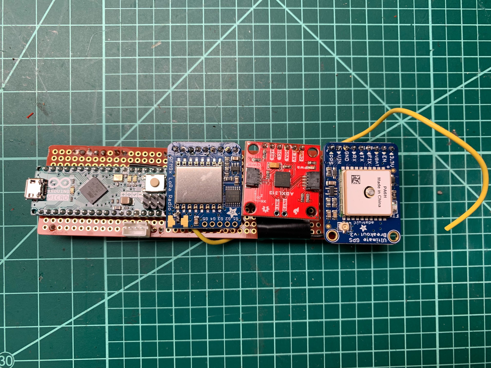
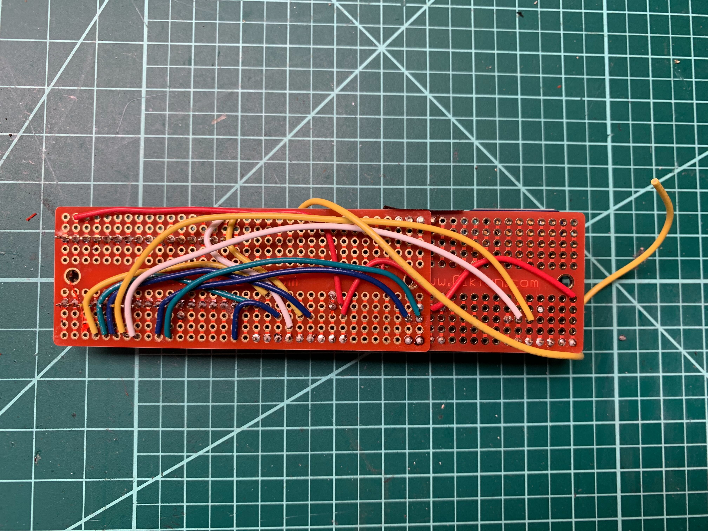
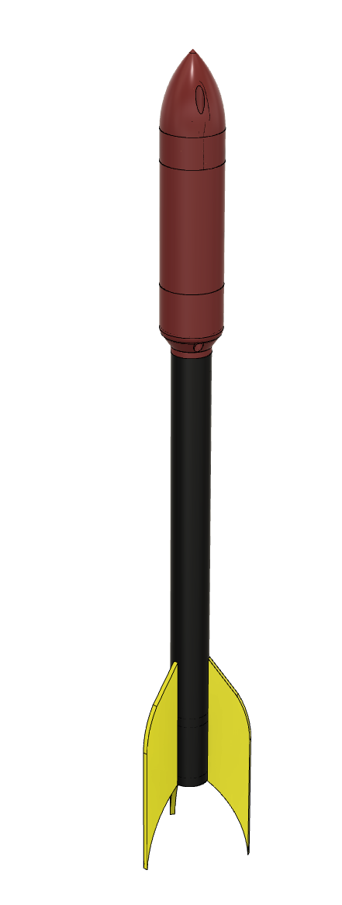

# The Kessel Run

By Chris Bensen



If you prefer you can read this blog post on Medium [here](https://chrisbensen.medium.com/project-kessel-run-fc081eb0fd03).

Rockets are cool, so why not create a cloud connected rocket. I'm calling this one Kessel Run. Happy May the 4th be with you! This is an IoT rocket. The flight computer is an Arduino + LoRa trasceiver + GPS + Acceleromiter broadcasting to a base station running a Raspberry Pi + LoRa trasceiver connected to my cell phone's hot spot to the internet and sending everything to the Oracle Cloud.

## Prerequisites

To build one you will need a few things.

1. You have an OCI account or a [Free Tier Account](https://medium.com/oracledevs/create-an-oracle-always-free-cloud-account-bc6aa82c1397).

1. Get the parts from [here](https://demoparts.withoracle.cloud/ords/r/au_cts/dvr-bom-creator/sharedbom?p10001_bomref=295451616379598227377985226295520958226).

2. Download the 3D printable files from [Thingiverse](https://www.thingiverse.com/thing:5377245).

## Building the Rocket

[Build Video](https://youtu.be/0xlxQlmg2g8)

Assembly is fairly stright forward. Download the 3D printable files and the fins. If you have access to a laser cutter it's super simple, otherwise print out the [`rocketfins.pdf`](files/models/rocketfins.pdf), place it over some thing balsawood and use an exacto knife to cut three wings out.

The nose cone comes in two pieces. Simply print those, I used a .4mm nozzle. If you add electronics then you can also print out the battery holder or if you use a different battery than a you will want to customize it. Easy hack is to just attach the wires to the ends of the battery using electrical tape.

## Flight Computer

For this step you will need the following items from the prerequisites above:

Lora Transeiver
https://learn.adafruit.com/adafruit-rfm69hcw-and-rfm96-rfm95-rfm98-lora-packet-padio-breakouts

Arduino Micro
https://www.etechnophiles.com/arduino-micro-pinout-schematic-and-specifications/

GPS
https://www.adafruit.com/product/746

Accelerometer
https://www.sparkfun.com/products/17241

### Wiring of the Flight Computer



Arduino Micro -> LoRa
MISO-pin 50 ->LoRa MISO
MOSI-pin 51 ->LoRa MOSI
SCK- Pin 52 ->LoRa SCK
Pin 9 ->LoRa CS
Pin 8 ->LoRa RST
Pin 7 ->LoRa G0
3.3v ->LoRa 3.3v
GND ->Lora GND

Arduino Micro -> GPS
Pin 3 -> ADXL313 SCL
Pin 2 -> ADXL313 SDA
3.3v ->ADXL313 3.3v
GND ->ADXL313 GND

Arduino Micro -> GPS
Pin 6 -> GPS TX
Pin 5 -> GPS RX
3.3v ->GPS 3.3v
GND ->GPS GND

I used the 433 MHz LoRa transeiver and it needs an antenna. For the 433 MHz band the wavelength is 299.792.458 / 433.000.000 = 69,24 cm. A quarter is 17,31 cm which is a good length so I cut a wire that length and soldered it to the antenna of both the trasmitter and receiver.

### Prototype Breadboard of Flight Computer

The flight computer then needed to be shrunk down so I soldered up some headers and wired up a prototype breadboard.




# Base Station

The base station is a Raspbery Pi connected to a LoRa transeiver which is connected to a phone via the phones mobile hotspot. The transeiver must be the same as the one installed in the flight computer.

Lora Transeiver
https://learn.adafruit.com/adafruit-rfm69hcw-and-rfm96-rfm95-rfm98-lora-packet-padio-breakouts

Any Pi 3 or Pi 4 will work.

Pi -> LoRa
Pi Pin MOSI -> LoRa MOSI
Pi Pin MISO -> LoRa MISO
Pi Pin SCK  -> LoRa SCK
Pi Pin 25 -> LoRa CS
Pi Pin 5 -> LoRa RST
Pi Pin CE1 -> LoRa G0
Pi Pin 3.3v  -> LoRa VIN
Pi Pin GND -> LoRa GND

## May The Source Be With You



Upload the following sketch to the Arduino. Note that you will also need the files [lora.h](files/arduino/lora.h) and [lora.cpp](files/arduino/lora.cpp).

[cloudrocket.ino](files/arduino/cloudrocket.ino)
```cpp
//Board: Arduino Mega 2560
//Processor: ATMega 2560

// LoRa
// https://www.adafruit.com/product/3073
// ATMega2650 ->LoRa
// MISO-pin 50 ->LoRa MISO
// MOSI-pin 51 ->LoRa MOSI
// SCK- Pin 52 ->LoRa SCK
// Pin 7 ->LoRa CS
// Pin 6 ->LoRa RST
// Pin 2 ->LoRa G0
// SS- pin 53 //N/A
//
// Arduino Micro ->LoRa
// MISO-pin 50 ->LoRa MISO
// MOSI-pin 51 ->LoRa MOSI
// SCK- Pin 52 ->LoRa SCK
// Pin 9 ->LoRa CS
// Pin 8 ->LoRa RST
// Pin 7 ->LoRa G0
// 3.3v ->LoRa 3.3v
// GND ->Lora GND
#include <SPI.h>
#include "LoRa.h"

const int csPin = 9; // LoRa radio chip select
const int resetPin = 8; // LoRa radio reset
const int irqPin = 7; // interrupt request pin

const byte localAddress = 0xBB;
const byte destinationAddress = 0xFF;
const byte syncWord = 0xB4; // Sync word (network ID)
const byte spreadingFactor = 7; //spreading factor (6-12)


// Accelerometer
// https://learn.sparkfun.com/tutorials/sparkfun-qwiic-3-axis-accelerometer-adxl313-hookup-guide?_ga=2.60797357.1096858093.1651183108-2026033215.1651006494
// Arduino Micro -> Accelerometer
// Pin 3 -> ADXL313 SCL
// Pin 2 -> ADXL313 SDA
// 3.3v ->ADXL313 3.3v
// GND ->ADXL313 GND
#include <Wire.h>
#include <SparkFunADXL313.h>
ADXL313 myAdxl;
const int accelerometerIC2Address = 0x1D;

// GPS
// https://www.adafruit.com/product/746
// Arduino Micro -> GPS
// Pin 6 -> GPS TX
// Pin 5 -> GPS RX
// 3.3v ->GPS 3.3v
// GND ->GPS GND
#include <Adafruit_GPS.h>
#include <SoftwareSerial.h>

SoftwareSerial GPSSerial(6, 5);
Adafruit_GPS GPS(&GPSSerial);
uint32_t timer = millis();

void setup() {
  Serial.begin(115200); // initialize serial

  //--------------------------------------------------------------------------------
  // Initialize LoRa
  Serial.println("LoRa Duplex Init");
  LoRa.setPins(csPin, resetPin, irqPin); // set CS, reset, IRQ pin

  if (!LoRa.begin(433E6)) { // 915E6)) { // initialize ratio at 915 MHz
    Serial.println("Error LoRa init failed");
    while (true);
  }

  LoRa.setSyncWord(syncWord);
  LoRa.setSpreadingFactor(spreadingFactor);
  LoRa.setTxPower(20, true);
  LoRa.setTimeout(10); //set Stream timeout of 10ms
  Serial.println("LoRa init succeeded"); //set the I/O pin modes:

  //--------------------------------------------------------------------------------
  // Initialize Accelerometer
  Serial.println("Accelerometer Init");
  Wire.begin(accelerometerIC2Address);

  //Begin communication over I2C
  if (myAdxl.begin() == false) {
    Serial.println("Error accelerometer init failed");
    while(1);
  }

  Serial.print("Accelerometer init succeeded");
  myAdxl.measureModeOn(); // wakes up the sensor from standby and put it into measurement mode

  //--------------------------------------------------------------------------------
  // Initialize GPS
  Serial.println("GPS Software Serial");
  GPS.begin(9600);
  // uncomment this line to turn on RMC (recommended minimum) and GGA (fix data) including altitude
  GPS.sendCommand(PMTK_SET_NMEA_OUTPUT_RMCGGA);
  // uncomment this line to turn on only the "minimum recommended" data
  //GPS.sendCommand(PMTK_SET_NMEA_OUTPUT_RMCONLY);
  // For parsing data, we don't suggest using anything but either RMC only or RMC+GGA since
  // the parser doesn't care about other sentences at this time

  // Set the update rate
  GPS.sendCommand(PMTK_SET_NMEA_UPDATE_1HZ);   // 1 Hz update rate
  // For the parsing code to work nicely and have time to sort thru the data, and
  // print it out we don't suggest using anything higher than 1 Hz

  // Request updates on antenna status, comment out to keep quiet
  GPS.sendCommand(PGCMD_ANTENNA);

  delay(1000);
  // Ask for firmware version
  GPSSerial.println(PMTK_Q_RELEASE);

  Serial.println("Setup Complete");
  Serial.flush();
}

int counter = 0;

void sendData(String name, String value) {
  String packet = "," + name + "," + value;
  Serial.print(packet);
  LoRa.print(packet);
}

void loop() {
  char c = GPS.read();

  if (c)
    Serial.write(c);

  // if a sentence is received, we can check the checksum, parse it...
  if (GPS.newNMEAreceived()) {
    // a tricky thing here is if we print the NMEA sentence, or data
    // we end up not listening and catching other sentences!
    // so be very wary if using OUTPUT_ALLDATA and trytng to print out data
    //Serial.println(GPS.lastNMEA());   // this also sets the newNMEAreceived() flag to false

    if (!GPS.parse(GPS.lastNMEA())) {   // this also sets the newNMEAreceived() flag to false
      Serial.println("GPS FAILED");
      return;  // we can fail to parse a sentence in which case we should just wait for another
    }
  }

  if (!myAdxl.dataReady()) {// check data ready interrupt, note, this clears all other int bits in INT_SOURCE reg
    Serial.println("Waiting for dataReady.");
  }
  else {
    myAdxl.readAccel();

    // send packet
    LoRa.beginPacket();
    LoRa.print("BEGIN,");
    sendData("id", String(counter));
    sendData("src", String(localAddress));
    sendData("dest", String(destinationAddress));
    sendData("x", String(myAdxl.x));
    sendData("y", String(myAdxl.y));
    sendData("z", String(myAdxl.z));
    sendData("day", String(GPS.day, DEC));
    sendData("month", String(GPS.month, DEC));
    sendData("year", String(GPS.year, DEC));
    sendData("fix", String((int)GPS.fix));
    sendData("quality", String((int)GPS.fixquality));

    if (GPS.fix) {
      sendData("latitude", String(GPS.latitude, 4));
      sendData("lat", String(GPS.lat));
      sendData("longitude", String(GPS.longitude, 4));
      sendData("long", String(GPS.lon));
      sendData("knots", String(GPS.speed));
      sendData("angle", String(GPS.angle));
      sendData("altitude", String(GPS.altitude));
      sendData("satellites", String((int)GPS.satellites));
    }
    LoRa.print(",END");
    Serial.println();
    LoRa.endPacket();
  }


  counter++;
  delay(50);
}
```

Copy the file `lora.py` to the Pi:

[lora.py](files/pi/lora.py)
```python
import time
import busio
from digitalio import DigitalInOut, Direction, Pull
import board
import adafruit_rfm9x
import requests
import os
import json

URL = os.getenv('URL')
print(URL)

if (URL is None):
  print("URL environment variable not found")

flight_file = open("lora.log", "a+")

# Configure LoRa Radio
CS = DigitalInOut(board.CE1)
RESET = DigitalInOut(board.D25)
spi = busio.SPI(board.SCK, MOSI=board.MOSI, MISO=board.MISO)
rfm9x = adafruit_rfm9x.RFM9x(spi, CS, RESET, 433.0)#915.0)
rfm9x.tx_power = 23

def get_val(data, name):
   index = data.index(name)

   if index != None:
     return data[index + 1]

   return None

def make_json(data, fields):
   result = {}

   for i in range(len(fields)):
     name = fields[i]
     result[name] = get_val(data, name)

   return result

while True:
    packet = None
    rssi = rfm9x.last_rssi

    # check for packet rx
    packet = rfm9x.receive(with_header=True)
    if packet is None:
        print("waiting")
    else:
        try:
          print(packet)
          packet_text = str(packet, "ascii")
          print(packet_text)
          data = packet_text.split(",")
          print(data)

          print(get_val(data, "x"), get_val(data, "y"), get_val(data, "z"))

          fields = ['id', 'x', 'y', 'z']
          j = make_json(data, fields)
          j["signal"] = "{0} dB".format(rssi)

          if (URL is not None):
            response = requests.post(URL, json = j)

          flight_file.write(json.dumps(j))
          flight_file.write(",\n")
        except:
          print("except")
```

Copy `lora.py` to your Pi.

## Cloud

Run with `python3 lora.py`. If you create the environment variable `export URL=<endpoint>` then all the data will be streamed to the REST endoint. This requires an Oracle Cloud account. You can get one for free called the [Free Tier Account](https://medium.com/oracledevs/create-an-oracle-always-free-cloud-account-bc6aa82c1397).

Stay tuned for future directions how to setup the cloud for streaming.
