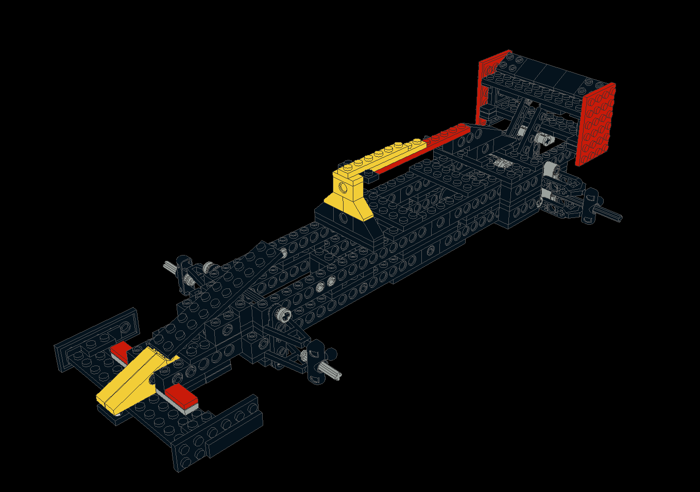

# Episode 3 - Building a Race Car Frame out of a Toy

By Chris Bensen

In my previous two episodes (links at the bottom of this article) I built a custom breadboard setup for a Raspberry Pi and Arduino. Although it can be used for any project, I 3D printed a pad of bricks and connected up an RC servo and DC brushless motor via and ESC for a very specific project: I'm building a race car!

I apologize for not coming out and saying what I'm building, but rather presenting it in some sort of teaser clickbait fashion. I just wasn't ready to reveal it and my management wanted me to take you all on a journey through the process rather than just 6-months of working in a closet with a big reveal at the end. But now we're at the point in the process where it's time reveal a bit more. Think of it as getting all ya'll involved.

I am building a cloud connected LEGO&copy; open wheel race car. That's a mouthful. I was calling it #CloudCar but that sounds too much like "clown car." I can't legally say some of these words, such as eff-uno, so let's call it the **Eff-Uno Racer**, or **FUR**. And because everything needs to have a version number, let's call it **FUR1**. Note that I had to add the 'R' to avoid the name sounding obscene.

After I reread that last paragraph I realized "maybe I am building a clown car."  Well, at least it should be an exciting one!

I basing my project off the [LEGO&copy; Kit 8440](https://www.bricklink.com/catalogItemInv.asp?S=8440-1) because it already exists and the parts list is easily available. You will see a lot of similarities. There are some amazing things out there for LEGO&copy; builders that not everyone may be aware of, such as open source LEGO&copy; CAD tools called [Bricksmith](https://bricksmith.sourceforge.io), [LDView](https://tcobbs.github.io/ldview/) and [LEO CAD](https://www.leocad.org). Bricksmith has some problems on the latest version of macOS, so I'm mostly using LEO CAD at the moment. I am also using Fusion 360 --- despite not being completely pleased with it --- to create my own custom parts to interface between the RC parts and the LEGO&copy;.

## The major parts of this project

1. The LEGO&copy; Frame + Custom 3D printed adapters for RC parts
1. The electronics - Raspberry Pi 4, Arduino, Pi Camera, RC Servo motor and Brushless DC motor + ESC (there will be more but this is enough for now)
1. The Pi software - Running Oracle Linux, GraalVM and Java
1. The Cloud software - Using [Oracle Cloud](https://www.oracle.com/cloud/free/?source=:ex:tb:::::&SC=:ex:tb:::::&pcode=WWMK210625P00074)
1. The Client software - TBD

The car is the first hurdle, and arguably the most important because it is the main character in this series. Nobody would watch the cloud drive a car around if there was no car. So, first things first, I'm building a car. A really really cool car. A really good car. Not a hacked together junker. This is a fast race car! I am building a car that any of you can build yourself, as inexpensively as possible, with easy-to-follow directions. This is no simple feat. There are a few challenges I didn't foresee, like the custom paint job and a global supply chain that's in the toilet. It's difficult, but I'm up for a challenge. And this is a challenge!

And we've hardly discussed the software. There is a lot here so stay tuned!

## The Status

So far process on #1 is going well. #2 is coming along. I'm building a custom PCB and hope to share more about that in a month or two. #3 and #4 have been prototyped but need a lot more work. I need to get a working car in the hands of some other engineers before much more work can be done here. What fun is doing something like this all by myself? I love collaboration. And if you have ideas or want to work on something, drop me a line!

As the project proceeds I have to be pragmatic and create things that will save time later. There is always a trade off here between time spent now vs time spent later. For example, during this week's video I received some Protopasta filament, and they have amazing cardboard spool holders, but they are a slightly different size than what my Ultimaker printer accepts. So I created a spool holder. [Download](https://www.thingiverse.com/thing:4942247) and print the spool holder or edit the 3D model.

## Where to go From Here

FUR1 will be as much LEGO&copy; as possible so you can simply use your existing boxes of your favorite bricks layin' around or buy the specific pieces needed. Only a few interface parts for the RC parts and electronics will be made. Plans will be made available to make your own. All 3D models will be available on [Thingiverse](https://www.thingiverse.com/thing:4940804), source code will be on [GitHub](https://github.com/oracle-devrel/eff-uno-racer), and you can follow along on the [Medium blog](https://chrisbensen.medium.com/), or [personal blog](https://chrisbensen.blogspot.com) [YouTube](https://www.youtube.com/c/ChrisBensen), [Oracle Developer website](http://developer.oracle.com?source=:ex:tb:::::&SC=:ex:tb:::::&pcode=WWMK210625P00074), [Oracle Developers YouTube Channel](https://www.youtube.com/channel/UCdDhYMT2USoLdh4SZIsu_1g) and [Twitter](https://twitter.com/chrisbensen).

## Q/A

Q: FUR1 implies there will be a FUR2?

A: Yes! Maybe even a FUR3. It will also fork to be a FUR1b, possibly with more RC than LEGO&copy; as we do the testing and find it falls apart too early when driving it FAST!

Q: Who is sponsoring this awesome project?

A: I'm glad you asked. Oracle Developer Relations have sponsored this project because Oracle has some amazing tech. Not only do they have the most robust operating system on the planet and the number one programming language (yeah, you heard me, Java rocks), as well as the fastest implementation of the JVM with GraalVM, they also have a really solid [cloud solution](https://www.oracle.com/cloud/free/?source=:ex:tb:::::&SC=:ex:tb:::::&pcode=WWMK210625P00074) that will be the backbone of this project.

Q: I don't think you can pull off such a crazy project.

A: I've done others that are arguably crazier. I built [The World's Largest Raspberry Pi Cluster (that we know of)](https://www.youtube.com/watch?v=KbVcRQQ9PNw) and [World’s Largest Working Lego Computer](https://www.youtube.com/watch?v=Y5m0R9tTdR0). All of these run Raspberry Pi, Oracle Linux, GraalVM and Java.

Q: When can I expect to see more of this project?

A: Twitter [https://twitter.com/chrisbensen](https://twitter.com/chrisbensen) has the most updates at the moment. There is also a YouTube playist for [DevRebel Cool Projects](https://www.youtube.com/playlist?list=PLPIzp-E1msrZ0WAvm20TkXtm7Hm5JnHxc).

---

__Episode 1 - Custom Raspberry Pi Zero Breadboard:__

- Short: https://youtu.be/-BF6zZbBVFA
- Extended: https://youtu.be/GUiLuG1Drjg
- Thing: https://www.thingiverse.com/thing:4868187
- Blog: https://chrisbensen.medium.com/starting-a-new-project-pi-zero-custom-breadboard-834df6414ac6

__Episode 2 - Pi Controlled Motors:__

- Short: https://youtu.be/9aLBQ6m8_kI
- Extended: https://www.youtube.com/watch?v=0F65hw3ntPk
- Oracle devs blog: https://medium.com/oracledevs/pi-controlled-motors-b5cf81eea42f
- Blog: https://chrisbensen.medium.com/pi-controlled-motors-b5cf81eea42f
