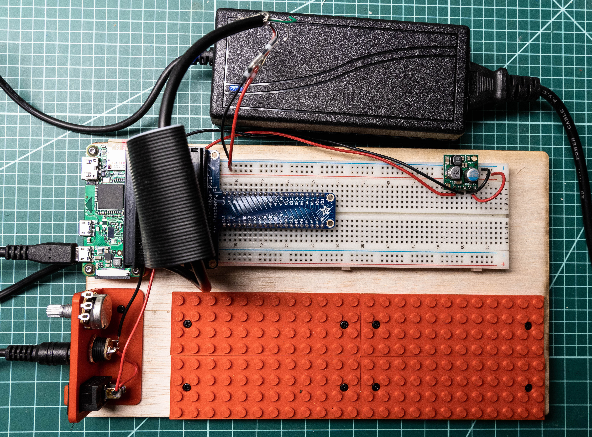

# Starting a New Project — Pi Zero Custom Breadboard
by Chris Bensen

If you prefer you can read this blog post on Medium [here](https://medium.com/chrisbensen/starting-a-new-project-pi-zero-custom-breadboard-834df6414ac6).

Every time I start a new project it’s different. Different set of challenges, different tools, different infrastructure and requirements. An entirely different end product.

I usually work on new projects, prototyping things that nobody has done before. Usually we know what the end product needs to be, but sometimes we’re discovering that as we go. I’m a big fan of Kaizen, which is Japanese for “continuous improvement”. I like to start off by taking a step back and looking at what is required, and with 80% of the knowledge, make a gut decision based on experience and jump right in.

Of course, I follow my Seven Step Process to Creating an Amazing Demo. This isn’t too different from an Agile process, but it’s less structured. Almost like Kanban. I start with the hardest problems first, but if I can’t figure out where to start, I will just start with what I know. It’s sometimes better to feel accomplished and have something to show for it than to spin your wheels. But I don’t like wasting my time and throwing the work away, so it’s always a balance. Sometimes throwing work away is exactly what is required and isn’t really throwing work away; it was required work to gain the knowledge needed to continue.

[Episode 1 — Custom Breadboard for Raspberry Pi Zero](https://youtu.be/-BF6zZbBVFA)

Episode 1 — Custom Breadboard for Raspberry Pi Zero
The “fail fast and early” mantra is near and dear to me, but I don’t like it in the traditional “hacker” sense. What I mean is more related to decision making. There are some decisions that are best delayed, and others that should be made as soon as possible. Knowing when to make a decision is a skill, and one I think can be taught. Everyone makes mistakes, so the trick with any team is to setup a no-blame culture where people can accept their mistake, fess up to it, and move on. In my experience, those are the teams that are the most successful and the most fun to work with.
My Grandpa always taught me to use the right too for the job. Now, he was just a rocket scientist who also built houses and knew a thing or two about electronics and explained Einstein’s theory of General Relativity to me when I was 10, but in my experience the same thing applies to any job. Everything is relative. If you only have one skill, like using a hammer, everything looks like a nail. So when I discover that I need a tool, I either find it or make it. Pragmatic Programmer is a book that I often refer to. (Disclaimer, I only read the book jacket but I feel like I got the gist of the concept and highly recommend the book.)

Last week I started a new project. This is partially an edge or IoT project (depending on how you look at it); A Raspbery Pi Zero will have some sensors and motors, connect to the Oracle Cloud and data will be visualized in a web browser in real-time. This will involve some LEGO&trade;. There are a lot of things that have been researched and are known, and a lot of things that we have absolutely no idea how they will work. Honestly, this is going to be fun because it is so nuts. That’s the best kind of project. No pressure.

We picked GitHub (for what seems like obvious reasons nowadays) for version control. Stay tuned for that. Because there will be multiple pieces, the programming language will be determined based on what works best for the job. Is “Beyond full stack” a thing? I can say that performance is key here. Java + GraalVM would be preferred, but there will be some Javascript and Python and probably some C++ —but I might try Go or Rust, or use GraalVM native image.
The first step is the breadboarding. Whenever I start a project, the prototyping phase is a mess of spaghetti. This makes it difficult when moving the project between my computer desk inside the house and workbench where the soldering iron is in the garage. I decided to solve this problem for my next project by making a custom prototype board and building it as clean as possible. Then I’ll share it all with you! So if you’re interested in making your own, head over to Thingiverse and checkout the Pi Zero Custom Breadboard. The three holes in the CAD rendering at the top (from left to right) are the power switch, 2.1mm power supply, and potentiometer. Here is a list of all the parts:

- Potentiometer
- 2.1mm jack (but I like these 2.1mm jacks better)
- Power Supply
- Breadboard
- Raspberry Pi Zero W
- Assembled T-Cobbler
- Pololu 5v 2.5a Step-Down Voltage Regulator
- Solid Core 22 AWG Wire
- Sandisk Micro SD Card
- Cabinet Door Bumpers
- Rocket Switch (I used an old switch but this one appears to have the same specs)
- (3) M2.5 x 6mm Phillips rounded head screw (this is as close as I can find
- (12) M2.5 x 4mm Phillips rounded head screw (this is as close as I can find)
- (4) M2.5 x .45mm Heat-set plastic inserts
- (4) Button head Hex M2.5 x .45mm 5mm long 18–8 stainless screw
- (2) Seal Heat Shrink Butt Connectors

I laser cut the main board from 1/4" poplar plywood, but have included a 3D printed version as well. These could be merged to be one big print, but I like to print things in pieces sometimes to account for modularity and print failure. I also printed the LEGO&trade; parts with a .25mm print head while I printed the rest with a .4mm print head. I used standard Red Ultimaker PLA. Overall it’s about a day of 3D printing.
Now I’m ready to start prototyping in the most organized way possible. I have no delusions, it’ll still get messy. Stay tuned for the next part in the series where I setup the Oracle Cloud services and the Pi Zero. You won’t want to miss it.
