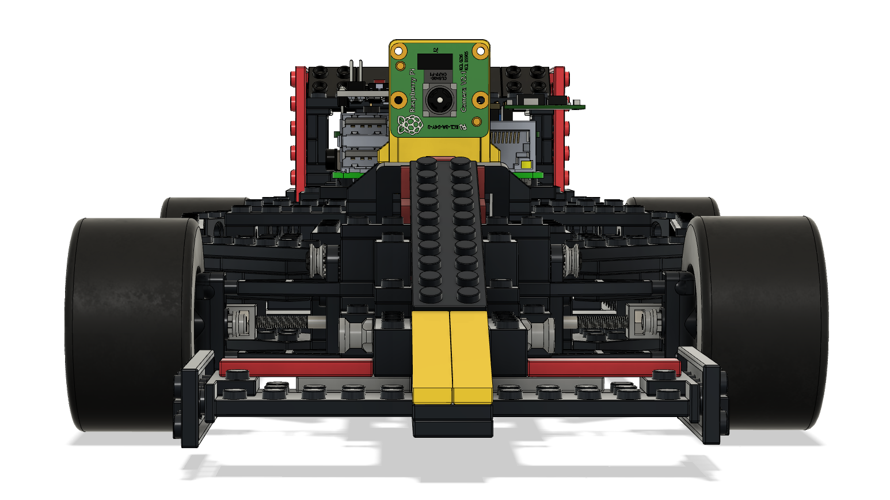
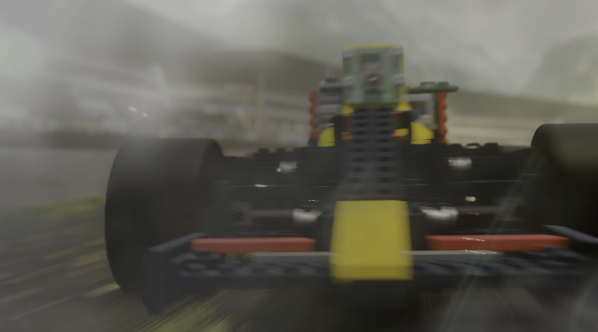
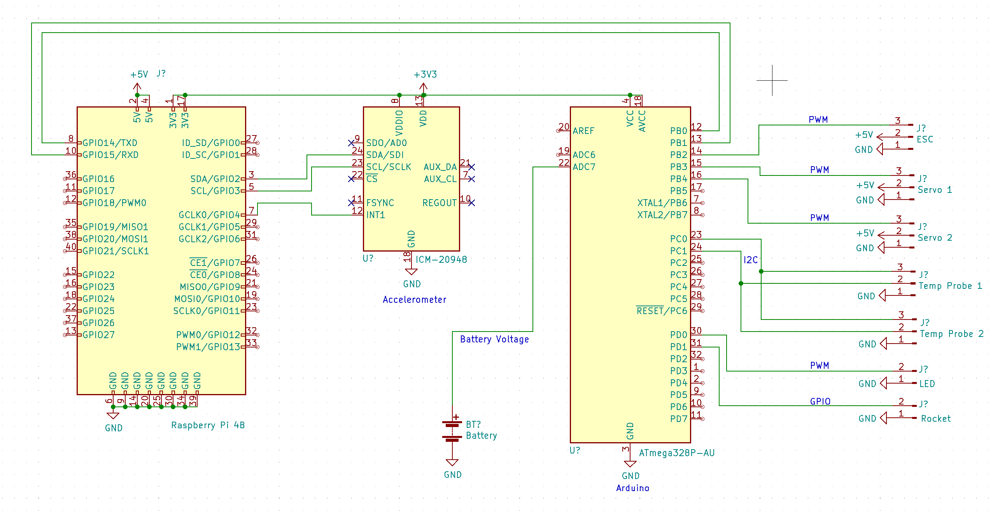

# Episode 7 - Building a PCB Hat for Raspberry Pi

By Chris Bensen

You can follow this project on GitHub [here](https://github.com/chrisbensen/eff-uno-racer).

A few episodes have gone by without an accompanying blog. There has been a lot of CAD, 3D printing, Blender and other behind the scenes stuff that is frankly boring. Also I've broken things into bite sized chunks for "algorithm" purposes. But now there's quite a bit to talk about! I've been building a custom PCB Pi Hat! This is very exciting because who doesn't want to make a custom Pi Hat? I was just talking with a friend today and the first response was "you can do that?"

Speaking of Blender, I'm going to digress briefly, the video series has a new intro scene. Check it out! We are also going to do a lot more Blender so stay tuned and check out this [video](https://youtu.be/amqxaw2Ujn4) for how to render in the cloud on a budget.

## Pi Hat

The Pi Hat is a 100% custom PCB designed and speced by me. I'm getting some help by SQFMI with the detailed laying out the traces and heavy lifting. SQFMI and I have worked together building the Code Card and Code Watches which turned into Watchy in the past. The software I've used to design PCB boards is called Eagle. There is a Fusion 360 Eagle plugin but I have not used it.

I created a spacer 3D print available on Thingiverse [here](https://www.thingiverse.com/download:10394744). It has to be one of the simplest 3D prints there is, but it works great keeping the Pi and Hat separated. I've actually done this with a number of other Pi projects so this spacer is very useful!

The first step was to prototype everything using breadboards. I documented this path in [Episode 1](https://youtu.be/-BF6zZbBVFA) and [Episode 2](https://youtu.be/9aLBQ6m8_kI). At the same time design the wiring diagram but at first it doesn't usually look this nice.

The wiring diagram omits some resistors, capacitors and line level converters, this is to simplify things so you can tell what pin is connected where.

At this point you know what you want works and doesn't work. Maybe you have a few friend chips. But you have a good idea what PCB board you want to build.

# Building a Custom PCB Board

As many have noticed there is an Arduino and a Raspberry Pi 4. This hat is on top of the Pi and an Arduino sits on top of the Hat. I needed a dedicated microcontroller for the high frequency that controls the ESC which controls the DC Brushless motor. Also by doing this a lot of work is pushed off to the Arduino for things microcontrollers are good at, being dedicated, and let the Pi just be the brains. The Arduino Micro does all this nicely. They are a little on the expensive side for what they do so I'm going to look into using a Raspberry Pico or Teensy in the future. That's when I'm at the **cost cutting** stage. Right now I'm at the **just get this thing to work** stage.

So once all the electronics are identified and a form factor start laying things out starting with placing the things that are what I call foundation pieces and can't move. For example the 4-pin Pi connector. Then start moving things around so they fit and the traces are nice and clean and you have something like this.

You'll want to double check everything 2-3 times before ordering a PCB. If you want to checkout the GERBER file you can find them in the repository [here](https://github.com/chrisbensen/eff-uno-racer/tree/main/electronics/GERBER). You can even send it to OSH Park (or any other places that can make a PCB) to have it made or just poke around and look at them. If you want to have some made yourself it'll cost you about $26 USD and they produce 3 units.

The [BOM can be found here](https://github.com/oracle-devrel/eff-uno-racer/blob/main/parts/BOM.txt), but I've broken it out and listed the items that I used in this blog:

- (1) Arduino Micro
https://store.arduino.cc/products/arduino-micro

- (1) Sparkfun ICM-20948 accelerometer
https://www.sparkfun.com/products/17241

- (1) Pololu D24V50F5 voltage regulator
https://www.pololu.com/product/2851

- (5) 10K resistor https://www.sparkfun.com/products/10969
- (1) 220 resistor https://www.sparkfun.com/products/10969

- (2) 10uF 16V capacitor
https://www.amazon.com/Electrolytic-Capacitors-Capacitor-Conditioning-Refrigerator/dp/B08L5ZL87P

- (2) 2N7000
https://www.amazon.com/CHANZON-100pcs-2N7000-Transistor-Channel/dp/B083TF4K6L

- (1) PN2222
https://www.sparkfun.com/products/13689
https://www.amazon.com/Adafruit-NPN-Bipolar-Transistors-PN2222/dp/B00XW2OK7M

- (1) FQP30N06L
https://www.amazon.com/BOJACK-RFP30N06LE-MOSFET-N-Channel-Transistor/dp/B07WR86ZGS

- (1) 5 pin 0.1" (2.54mm) pitch header single row male for voltage regulator
5 pin female header 1.0 pitch
https://www.sparkfun.com/products/18218

- (1) 6 pin 0.1" (2.54mm) pitch header single row male for accelerometer
6 pin female header 1.0 pitch
https://www.sparkfun.com/products/18219

- (2) 17 or 18 pin 0.1" (2.54mm) pitch header single row male for Arduino
18 pin female header 1.0 pitch
Female Header
https://www.mouser.com/ProductDetail/3M-Electronic-Solutions-Division/929870-01-18-RA?qs=neFkstNq%252B6Hwvp%2FqzdGcyg%3D%3D
https://www.amazon.com/gp/product/B07CGGSDWF/ref=ppx_yo_dt_b_asin_title_o00_s00?ie=UTF8&psc=1
https://www.sparkfun.com/products/115

- (1) 2x20 female 0.1" (2.54mm) pitch headers for the pi
Pi Header
https://www.sparkfun.com/products/14017
https://www.amazon.com/gp/product/B00R1LLM1M/ref=ppx_yo_dt_b_asin_title_o00_s00?ie=UTF8&psc=1

- Male Header
https://www.sparkfun.com/products/116

- Wire
https://www.amazon.com/BNTECHGO-Silicone-Flexible-Strands-Stranded/dp/B01AO7586O

I could talk about details but I don't really know what is interesting to everyone so I'm going to suggest watching the video, I will embed it to this blog once it is posted, and feel free to ask questions. Maybe you have some feedback that will save some time or is a better way of doing things. I love constructive feedback. I certainly don't know everything. The best way to engage me is through [Twitter at this link](https://twitter.com/chrisbensen) but I will answer comments on Medium as well.

---

__Episode 1 - Custom Raspberry Pi Zero Breadboard:__

- Short: https://youtu.be/-BF6zZbBVFA
- Extended: https://youtu.be/GUiLuG1Drjg
- Thing: https://www.thingiverse.com/thing:4868187
- Blog: https://chrisbensen.medium.com/starting-a-new-project-pi-zero-custom-breadboard-834df6414ac6

__Episode 2 - Pi Controlled Motors:__

- Short: https://youtu.be/9aLBQ6m8_kI
- Extended: https://www.youtube.com/watch?v=0F65hw3ntPk
- Oracle devs blog: https://medium.com/oracledevs/pi-controlled-motors-b5cf81eea42f
- Blog: https://chrisbensen.medium.com/pi-controlled-motors-

__Episode 3  - Building the Racecar Frame:__
- Short Video: https://youtu.be/LdEc4mMFxYc
- Blog: https://chrisbensen.medium.com/building-a-race-car-frame-out-of-a-toy-c7bec93e53b3
Thing: https://www.thingiverse.com/thing:4942247

__Episode 4 - Putting a brushless DC motor into a toy car:__
- YouTube: https://youtu.be/HyF0RWx8g84
- Thing: https://www.thingiverse.com/thing:4940804

__Episode 5 - Next Stage: 3D Printed RC Servo Motor Adapters:__
- YouTube: https://youtu.be/jEd3AQucW5Q

__Episode 6 - Use a Pi on a Toy Brick:__
- YouTube: https://www.youtube.com/watch?v=0sjXmYHnOKY&list=PLPIzp-E1msrZ0WAvm20TkXtm7Hm5JnHxc&index=1
