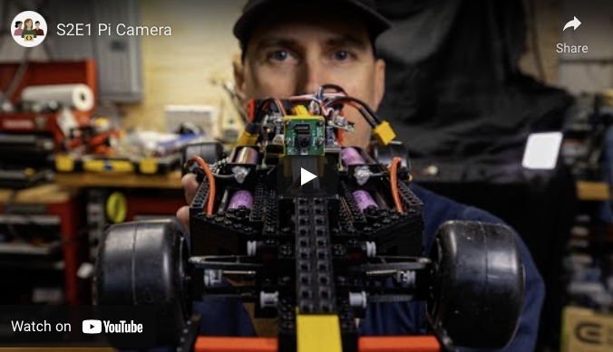

# Season 2 Episode 1 - Pi Camera

By Chris Bensen

You can follow this project on Medium [here](https://chrisbensen.medium.com/happy-%CF%80-day-season-2-episode-1-pi-camera-8dd998ee19d8).

Happy π day everyone! Last week I wrote how to [stream a Pi camera to Oracle cloud](https://chrisbensen.medium.com/stream-a-pi-camera-to-oracle-cloud-part-ii-7ded4258b117), the second post. This week I made a video for π day and the π Racer by adding the π camera to the π racer.

[](https://youtu.be/7-pzfxkDghY)

This season there will be some hardware changes but it's all about the code. Code and instructions. We want you to build your own, if you want. Currently everything is in various forms of research and prototyping. Every few weeks I will be moving the needle forward and post code, a blog or a video when there is a major milestone. The Pi camera has been a major milestone. I wouldn't call it production ready, it doesn't reconnect or handle errors and the Pi camera runs for a very short period of time because of this line of code:

  ```
  camera.wait_recording(6)
  ```

This is an odd function. There is no **record forever**. Honestly I'm trying not to put too much of an investement into the Legacy Camera System but the new Camera System isn't ready either. Some things to look forward to in Season 2 are:

* Saving streamed video
* Analytics - the π Racer has an acceleromiter, temperature and voltage to monitor
* Controller - sending car control signals from across the internet
* Replay - digital twin
* ML/AI - autonomous driving
* Parts Manager - Check out the parts to make this project by going to the APEX app https://demoparts.withoracle.cloud/ords/r/au_cts/dvr-bom-creator/. We are going to make this available to you to use for managing your projects!
* Native Image using GraalVM
* Step by step directions


If you have any questions or for interactive support and community check out Oracle's public [Slack channel](https://oracledevrel.slack.com/join/shared_invite/zt-uffjmwh3-ksmv2ii9YxSkc6IpbokL1g#/shared-invite/email) for developers.
