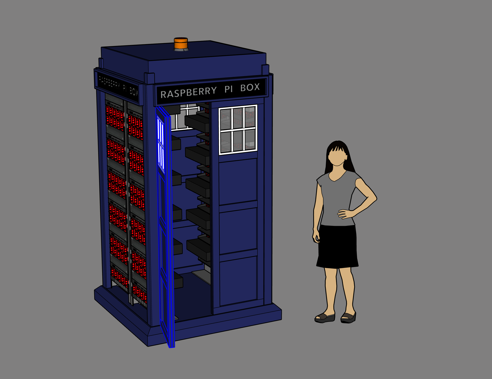

# A Temporal History of The World's Largest Raspberry Pi Cluster (that we know of)

by [Chris Bensen](https://twitter.com/chrisbensen)

If you prefer you can read this blog post on Medium [here](https://chrisbensen.medium.com/a-temporal-history-of-the-worlds-largest-raspberry-pi-cluster-that-we-know-of-4e4b1e214bdd?postPublishedType=initial).

The Raspberry Pi Super Computer was originally built for Open World in October 2019. We have 1050 Raspberry Pi 3b+ in four server racks configured in a big square box reminiscent of a British Police box popularized in a certain British Television TV series. Fast forward to today the Pi Cluster The Raspberry Pi Super Computer (Pi Cluster) got sent to e-waste, some parts stripped off it, sat dormant for 2 years then May of this year found it's way to my garage where it would get a complete overhaul.

## A Temporal History

# 2018

In early 2018 a small group of enthusiastic pre-sales engineers from Oracle Switzerland presented their 12-node Raspberry Pi cluster at the Hackzurich hackathon mimicking an Oracle Cloud data center with 3 availability domains. It ran a fully operational Kubernetes cluster on top of it and could demo node and availability domain fail-overs. Gerald Venzl wrote about this in [Building the world’s largest Raspberry Pi cluster](https://blogs.oracle.com/developers/post/building-the-worlds-largest-raspberry-pi-cluster). Fast forward to Open World 2018 in October Stephen Chin and Gerald Venzl presented me with this cluster and the concept of doing a LOT of small ones so they could come together and become a really big one. Gerald thought 1,000 Pi would be cool. I told him "That is a terrible number. You need 1024". Gerald and Stephen got big smiles on their faces and the seed of the Pi Cluster was planted. Over the coming months Jasper Potts and I brainstormed how to make this happen and started making stpreadsheets of lists of parts and I reached out to our suppliers to get quotes for all those parts.

# 2019

The idea got socialized around the company and garnered support from all the leads of the teams we would showcase technology from, and approvals for purchases started happen. I went shopping for a lab because we were going to need a lot of space. We needed lab anyway for the other experiences we built and built like Bullet Time or the Escape Rooms so the lab was a needed tool. I kitted it out with soldering irons, oscilloscope, 3D printers, 4 legged desks, and everything else you could need for a real maker's space. We considered using the Pi Compute modules and there were some really cool 4-Pi boards but 250 of them would be too expensive. We thought about custom boards but that would take too much time. This is when we decided to use off the shelf hardware just like anyone can buy and just use a regular Raspberry Pi 3B+. The Pi 4 wasn't available yet. The Pi arrived February 2019 before I had my lab and got stored in other labs until June when the Developer Marketing Hacker Lab was finally opened.

Between February and April I did a lot of traveling to support the existing experiences, ordering parts and brainstorming and research for how to build this cluster. Jasper Potts and I would talk almost daily trying to make sure we had every possibly part we needed and to make sure each piece of the project was going to be possible and contingencies in case things didn't work out. The four problems at this point were:

1. Power
2. Networking
3. SD Cards
4. Software
5. What would it look like

I eventually found a 60-port USB power supply, ordered one to test, it worked so ordered 30 of them. It's always good to have backups. After some initial network tests with an 8 Pi Cluster with standard home routers and gateways we realized a standard home network wasn't going to work. If we built a lot of tiny Pi Clusters there were the problems of cost for all the routers and gateways then when the cluster came together as one the each cluster would a cluste of clusters a couple times in a tree configuration where each node is either a single Pi or a a tiny cluster. It would have been a cluster of clusters or be "reconfigurable". Configuring and maintaining this any way you do it would be a lot of work. But with over 255 devices to be a single cluster we had to go with Class B and that's when serious networking equipment is needed. In May Stephen Chin and I sat down with a list of the problems. We had power solved, at least for the Pi. We would have to readdress this for the entire cluster. We went with Ubiquity networking. It is the least expensive of the serious networking hardware and has all the features that we would need. We decided to not order SD cards and try for network booting. This would come back to bite us later but SD cards for every Pi would take too much time and cost $16,000. Network booting would solve a lot of problems. But I'll dig into this later. Writing software for anything like this is challenging and people get their doctorates spending entire careers coming up with algorithms that can be split across multiple threads or compute modules. We decided to bring in Johan Vos and José Pereda of GLUON and do this as a Java community project. They brought in Gerrit Grunwald and a few other people I wasn't even aware were doing work.

The last piece of the puzzle was what would it look like. I had started prototyping and researching different ways to hold the Pi but it started to look like this thing would be about 8-12 server racks if I went with the typical density I was seeing on the internet. I sat down with a dozen Pi, a couple Ubiquity switches and mounted them in a small server rack. I then held the Pi next to one another in different configurations. 1U they'd have to all lay flat. Could only get 4. But if I put them vertically it would be a 2U but a lot more could be stacked. Over coffee then lunch at his dining room table we discussed putting it into an old VAX or Cray CS6400 with seats. A big rainbow arch that people can walk under. We even thought about a tree where the Pi grew on it like fruit. I showed him some of the prototype work. We realized for logistics it needed to be a box. We did the math and thought we could cram it all into 4 racks. Maybe. It was going to be tight. But if we could, then a telephone booth would be cool. Superman had a cool telephone booth. Maybe a red British one. Or...a blue British Police Box. We both got a bit smile went to work with some renderings, slide decks, and more prototyping. But Jasper Potts rendering is the one that we started using.

I was trying to get the highest density I could by cramming in at least 20 Pi into a 2U. The problem was this left us with about 50 extra Pi so it wouldn't fit. It's kind of like the rocket equation. The more Pi you have the more infrastructure you need thus more space and power. At first I 3D printed a huge print where the Pi just slid into place and were held in with another print. Unfortunately my printer wouldn't print a full rack that size and if it could it took 24 hours. I tried a lot of things. That's when I got the idea to use an 18" 1"x1/2" piece of 80/20 with the end milled off by 16.35mm then tap the hols in the ends, print 21 pi caddies and two ends and that was the solution. I should backup at this point and mention that we did consider POE for all the Pi. We tried this but the POE hat was mutually exclusive because it required some firmware changes to network booting, then all the switches would have to have all POE ports, I had difficulty finding more than 16 port POE switches and the density would have been 1/2 what we were able to get.

Everything was moved to the Developer Marketing Hacker Lab in June and a few people like Blaine Carter flew out to help set it up. I decided to bring in my camera and tripod and record what was going on giving the camera little attention besides to make sure it was pointed in the general direction and recording. This video would later become Pi Cluster Video on March 14th 2020. World’s Largest Raspberry Pi Cluster (that we know of)
 I did record a few choice moments. At this point in time I had discovered Casey Neistat and thought his videos were interesting.

I was trying to document everything as I went knowing full well it's nearly impossible to document after the fact. Here are the blogs from that time describing the caddies and how they came to be.

- [Very Large Raspberry Pi Cluster Part 1](http://chrisbensen.blogspot.com/2019/06/very-large-raspberry-pi-cluster-part-i.html)
- [Very Large Raspberry Pi Cluster Part 2](http://chrisbensen.blogspot.com/2019/06/very-large-raspberry-pi-cluster-part-ii.html)
- [Very Large Raspberry Pi Cluster Part 3](http://chrisbensen.blogspot.com/2019/06/very-large-raspberry-pi-cluster-part-iii.html)
- [Very Large Raspberry Pi Cluster Part 4](http://chrisbensen.blogspot.com/2019/07/very-large-raspberry-pi-cluster-part-iv.html)
- [Very Large Raspberry Pi Cluster Part 5](http://chrisbensen.blogspot.com/2019/07/very-large-raspberry-pi-cluster-part-v.html)
- [Very Large Raspberry Pi Cluster Part 6](http://chrisbensen.blogspot.com/2019/07/very-large-raspberry-pi-cluster-part-vi.html)
- [3D Printed Parts](https://www.thingiverse.com/thing:3958586)

Durring this project I started actually posting to Twitter. I took this video while heading home at midnight, edited the video with iMovie on my phone while waiting for the elevator doors to open and while walking to my car and by the time I got to my car had posted it.

I was actively recruiting, we still had a lot of unknowns but one of the big ones was the time it would take. If something takes 1 minute and you have 1,000 of them then that's over 16 hours. Blaine Carter and I were busy printing 1,000 caddies, the end brackets and everything else that we needed that was custom from a total of, get this, 12 3D printers. The brackets took 45 minutes. And that is after optimizations. There were months of 3D printing, but we had to be sure they were perfect. And 3D printing is amazing and can print a thing out of nowhere in a short period of time but if you need 1,000 of them it is going to take a long time. Yolande Poirier knew of some students at 42 Silicon Valley. They came by started helping, I bought them pizza offered to mentor them. They came back the next day with more students. Some students would change but a core group who I remain friends with today came day after day. We setup assembly lines for removing the Pi from their packaging, lining them up for install into caddies, then to be assembled into a 2U rack of 21 Pi. We ended up with 50 2U caddies. Actually the plan was to build two 84 Pi Mini Clusters so we made a total of 9 more for a total of 59. One was extra. Turned out we needed this one. I'll explain later.

Slowly the Pi Cluster took shape. The printers were running 24-7, I started working 7 days a week and at least 15 hours a day. It wasn't healthy but everyone working on it was having a great time. Great people, I made sure we always had food, and cool toys, that's all an engineer needs besides a little bit of sleep. The students were learning a lot, and they were and are smart so things got done. One of the parallel tasks was the software and for any software project you need a good operating system. The idea had been presented to Wim Coekaerts and the Oracle Linux team and they were 100% on board to give the Pi Cluster a custom version of Oracle Linux 7. A good friend of mine Roy Feague had some time on his hands and was enjoying the challenge of network booting the Pi. The Pi is designed to network boot but we found that the firmware had a bug. When the Pi boots up to communicate with the DHCP server to get an IP address it doesn't do a correct lease, release, bind. It renews the IP but stops there. So multiple Pi could and do get the same IP. So we had to get the MAC address of every single Pi and hard code it into the dhcpd.conf. It seems backwards to use DHCP to only have static IP addresses but there you have it. Roy started off with Ubuntu and Raspbian so we could use on NFS mount shared by all Pi and use overlay file system so none of them did a write back. Here is a good article on [Raspberry Pi PXE Boot – Network booting a Pi 4 without an SD card](https://linuxhit.com/raspberry-pi-pxe-boot-netbooting-a-pi-4-without-an-sd-card/) that didn't exist back then. The net boot process works like this:

1. Power on the Pi, NIC firmware sends DHCP request
2. DHCP server responds with a lease and server options
3. Pi configures network and requests bootstrap files
4. Server sends files to client via TFTP
5. Pi boots kernel and boostrap image then complets OS boot.

The Oracle Linux team got Oracle Linux 7 working with a small 8 Pi cluster and we had the rest of the cluster coming together so we tested booting but we had to boot 42 Pi at a time. This is where Ubunto fell over. Oracle Linux 7 was tuned and worked great. Not perfect, even to this day with Oracle Linux 9 it doesn't work perfect. We think it's because of network hickups, or Pi firmware glitches. Most of the time when we boot 42 Pi they all boot. But once in a while only 37 will boot and even less often less than that. The process is shutdown and try again.

At this point it's early October 2019 the Pi cluster is nearly all assembled, the operating system is mostly working, we can boot most of the Pi boot and it's time to ship the cluster to Moscone for Open World San Francisco 2019. The design of the cluster was to bolt plywood to it and it would become the create. But the casters installed on it weren't good for rolling so we used a pallet jack. We actually had to remove a railing from the fright elevator to get it in but we got it in the truck, with a GoPro mounted in place so we could get transportation video. Turned out the battery died. I didn't set it to time-lapse. I'm not a big fan of single button interfaces.

Once at Open World we set it up, installed the Java community project and managed to boot 980 Pi. The day after the Pi Cluster debuted 42 news outlets, including [Tom's Hardware](https://www.tomshardware.com/news/oracle-raspberry-pi-supercomputer,40412.html) and [Slashdot](https://developers.slashdot.org/story/19/09/21/0334244/oracles-new-supercomputer-has-1060-raspberry-pis) were reporting on the cluster. There were a few random Pi that wouldn't boot and a bank of 42 that I couldn't reach that had become unplugged. But the heat was too much to leave it on for any length of time. We had 7 large fans and had some experts come look to give us their opinion on cooling but the common response was "it might work". The top half did. The bottom half, especially those under the server that went clear across blocked the flow of air and those Pi overheat.

After Open World the Pi Cluster went back to the Developer Marketing Hacker Lab for upgrades and repairs and a trip around the world. It was going to London, Milan, Berlin and New York City. But after talking with the events teams at each of these locations, the earlier requirements, 200amps of power and double doors were difficult to satisfy. We went round and round. Finally I decided to build one of the 84 Pi Mini Clusters I had plans for and on December 20th 2019 it shipped out for Open World Dubai in January of 2020.

Here is a [parts list for the 84 Raspberry Pi Mini Cluster](http://chrisbensen.blogspot.com/2020/11/parts-list-for-raspberry-pi-mini-super.html).

# 2020

I met up with the cluster at Open World London February 2020 and instead of a Java community project I ran SETI@home.

This was the beginning of the pandemic all future events were canceled and lots of internal shuffling ensued. One big shuffle is everything was going virtual. I realized I had a lot of video footage of building the Pi Cluster and Pi Day was coming up so I spent a few days editing a video trying to tell a fun story for Pi Day. The result was this viral video in big part to Jim Grisanzio.

At this point I proposed a few other virtual experiences. The most notable was the [LEGO© Inspired Race Car](https://github.com/chrisbensen/eff-uno-racer) which started the partnership between Oracle and Red Bull. But I digress. As part of the internal shuffling, there was the closing of Developer Marketing Hacker Lab. We transferred tools and items to other labs and other storage options as possible, I transferred my lab to Oracle Labs as one of their labs and left the Pi Cluster there with signs to save do not trash. We had the Santa Cruz fires the same week the lab was being cleared out and I got a call that the Pi Cluster was in e-waste. When the lab was clared out they cleared it out. Everything that wasn't nailed down. I drove into the office and pushed the Pi Cluster back into the lab but a couple switches, and two Pi 2U racks and a 60-port USB power supply had been removed. There wasn't much I could do about it or some of the other stuff that got tossed into e-waste that had "save" written on it, after all I was living out of a suitcase for a couple weeks from the fire evacuation. But the Pi Cluster sat like that for another year and a half. Fortunately it was kept company by two smaller 84 Pi Mini Clusters one of which in November of 2020 I recorded a video building the 2nd 84 Pi Mini Cluster in my garage and posted it to YouTube.

# 2022

The Pi Cluster had come up a few times in conversation but due to the unknown state and no physical conferences it sat. Finally in February of 2022 the conversations got serious and this is when the Pi Cluster came to visit me and my family at home for the past 6 months.

I wrote about the Pi Cluster from this point forward in [The Raspberry Pi Super Computer in DevNucleaus at Cloud World 2022](TODO)

If you are interested in other posts, I created a blog post to include all Pi Cluster relate posts [here](http://chrisbensen.blogspot.com/2020/11/all-raspberry-pi-super-computer-posts.html). It has since gotten out of data but it includes everything up through 2020.
