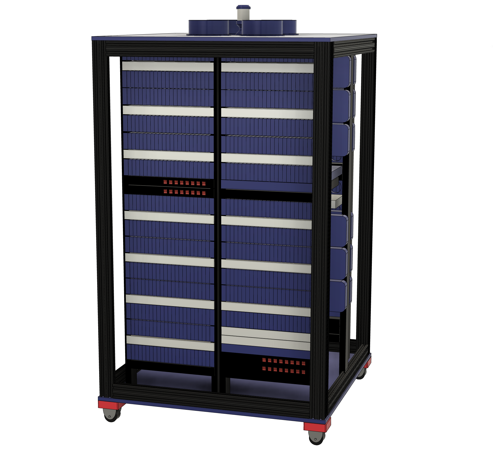
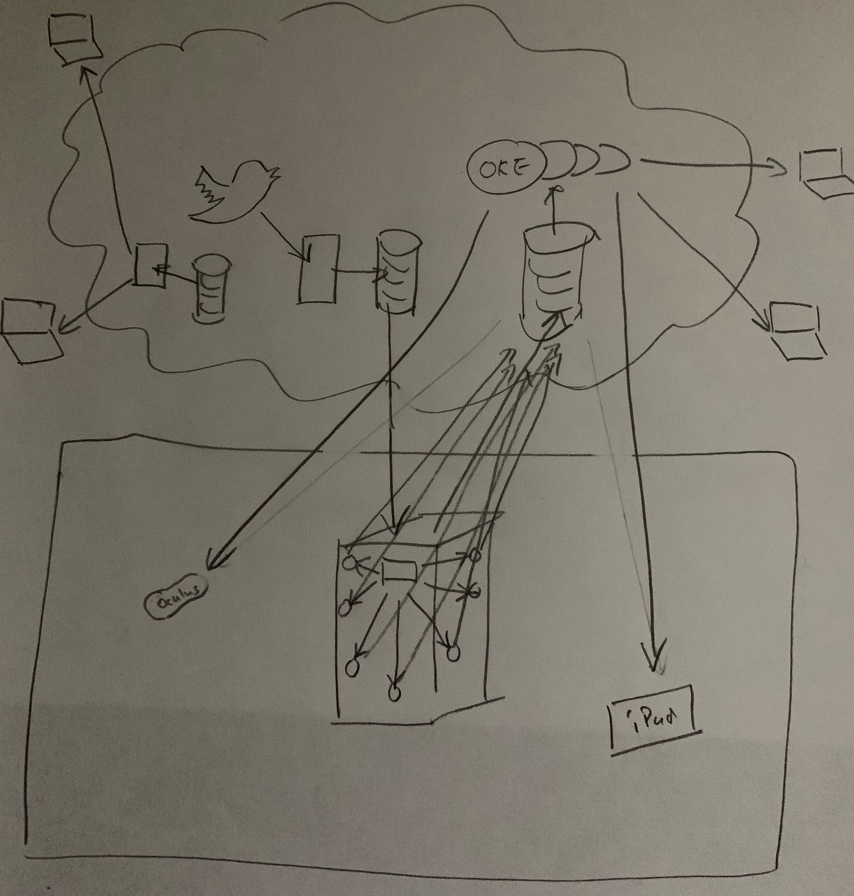

# The Raspberry Pi Super Computer in DevNucleaus at Cloud World 2022

by [Chris Bensen](https://twitter.com/chrisbensen)

If you prefer you can read this blog post on Medium [here]().

The Raspberry Pi Super Computer was originally built for Open World in October 2019. We have 1050 Raspberry Pi 3b+ in four server racks configured in a big square box reminiscent of a British Police box popularized in a certain British Television TV series. Fast forward to today the Pi Cluster The Raspberry Pi Super Computer (Pi Cluster) got sent to e-waste, some parts stripped off it, and sat dormant for 2 years until May of this year found it's way to my garage for a complete overhaul.


For a temporal history of how 1050 Raspberry Pi came to be, you can read [A Temporal History of The World's Largest Raspberry Pi Cluster](https://medium.com/chrisbensen/a-temporal-history-of-the-worlds-largest-raspberry-pi-cluster-that-we-know-of-4e4b1e214bdd). It begins with Gerald Venzl at Oracle Switzerland bringing the 12-node cluster to my attention, and we brainstormed a big cluster with Stephen Chin. Learn how the Pi Cluster went to e-waste during Covid lockdowns and the California fires and Eric Sedlar rescued it, eventually storing it at Oracle Labs. If you find that too long, watch the [original build video](World’s Largest Raspberry Pi Cluster (that we know of)
https://www.youtube.com/watch?v=KbVcRQQ9PNw), this [Building the world’s largest Raspberry Pi cluster](https://blogs.oracle.com/developers/post/building-the-worlds-largest-raspberry-pi-cluster) by Gerald Venzl and this video [Big Pi Cluster In My Garage - Part I](https://www.youtube.com/watch?v=ELvkg_88XSY).


## Resurrection

When CloudWorld was announced I immediately proposed we resurrect The World's Largest Raspberry Pi Super Computer (that we know of). Who doesn't like a good resurrection story. The proposal went something like this:

1.	Donate it to the Computer History Museum as a non-functional art piece for Pi-Day.
2.	Raspberry Pi are valuable now. Raffle off a piece of the Pi to win a free Raspberry Pi 3B+ from the World’s Largest Raspberry Pi Cluster.
3.	We have one opportunity to make history. We fix it for CloudWorld, add fans so it doesn't overheat, and run it as an "on prem" and "edge" device showing off tech that is being built in the labs. We'll include GraalPython, [Java](https://www.oracle.com/java/) and [Oracle Linux 9](https://www.oracle.com/linux/) running on every device on the Pi Cluster. It's all connected to [Oracle Cloud Infrastructure (OCI)](https://www.oracle.com/cloud/) through Site-to-Site (scroll to the bottom for directions on this) VPN for on prem and via micro-services, compute instances, Autonomous Database, Services Gateway and Load Balancer. AR visualizations would be ideal, and run something cool on it like when we ran SETI@home on the Raspberry Pi Mini Super Computer; an 84 Pi Cluster. I came up with the idea to setup a service so anyone in the world can send code to the cluster to run a workload, as we show off our Digital Twin AR/VR services and create blogs and videos to inspire developers and students. We can show people why developers and students are having a lot of fun learning and using [Oracle's Free Tier](https://www.oracle.com/cloud/free/?source=:ex:tb:::::RC_WWMK220309P00059:Medium_CBensen&SC=:ex:tb:::::RC_WWMK220309P00059:Medium_CBensen&pcode=WWMK220309P00059). Plus, we can get the Guiness Book world record.

We choose option three and the search for a new lab began. I spoke with the leadership of the various product teams mentioned above, as well as leaders in the Raspberry Pi community like [Jeff Geerling](https://twitter.com/geerlingguy) and Eben Upton, and laid out a plan. I can’t tell you about the entire plan because we’ve just set the foundation for it, but there is a lot more to come. This is just the story of getting the Pi Cluster to DevNucleus at CloudWorld and a brief mention of what happens after. It turns out a Guinness Book adjudication is really expensive!

The first step was to identify a budget and an estimate of the work and if it is feasible. We knew we needed:

1. Fans. Lots of fans.
2. Replace any parts missing.
3. Test everything out.
4. Write new software. Every Pi network boots. In 2019 I had Oracle Linux 7 running on the entire cluster but did it still work, did we have all the source code, MAC addresses and everything needed to do it again. In [A Temporal History of The World's Largest Raspberry Pi Cluster](TODO)

The second step was to get a place to work on the Pi Cluster. Try finding a place with double doors, close to a freight elevator, with enough power and space to work on it and a network that isn’t locked down tight — not easy! I looked at Oracle facilities around the world. The logistics of working on something like this remotely and all the physical work that would have to be put into it meant anywhere in the world would work only if certain requirements were met. I’d have to travel there, set everything up, and have a dozen people to help. We’d set it up for remote access but someone would have to be available in person when things didn’t work right. After a nice lunch with my amazing wife, we decided our garage worked the best and that’s where [#BigPiClusterInMyGarage](https://twitter.com/search?q=%23BigPiClusterInMyGarage&src=typed_query) started.

# Adding Fans - Cooling the Raspberry Pi

Once it was delivered I went to work ensuring our budget was accurate then rectifying and testing things while ordering replacements (mostly fans). Lots of fans: 250 fans to be exact. The cluster ended up with 257 fans and that isn’t counting the fans that are in each of the switches, server, or power supplies. This required that I disassemble the entire cluster and reassemble it. Not every bolt was removed, but all 50 21 Pi 2U banks were disassembled, every 5th Pi removed and replaced, which meant 250 new Pi caddies with brackets for fans had to be printed. You can learn about that [here](https://www.thingiverse.com/thing:3958586). [Victor Agreda](https://twitter.com/superpixels) used his newly purchased Ultimaker S5 to print a few dozen of the fan version of the caddies. The fans all needed power, and thanks to [Eli Schilling](https://twitter.com/ThatEliGuyatOCI) for creating many of the wiring harnesses. In addition, we added some easter eggs. I know it isn’t much of an easter egg if I tell the world about it, but I’ll explain it in more detail in the Warble section below because it’s too cool to not say anything. I have a few videos documenting some of the work that can be found in [A Temporal History of The World's Largest Raspberry Pi Cluster](https://medium.com/chrisbensen/a-temporal-history-of-the-worlds-largest-raspberry-pi-cluster-that-we-know-of-4e4b1e214bdd).

# Operating System - The Smartest Operating System Around

I think a lot of us underestimate a good operating system when building out infrastructure and hardware. And Oracle Linux is top notch. I go into more detail about the operating system in [A Temporal History of The World's Largest Raspberry Pi Cluster](https://medium.com/chrisbensen/a-temporal-history-of-the-worlds-largest-raspberry-pi-cluster-that-we-know-of-4e4b1e214bdd) (and I have some other stuff I’m working on so you can setup network booking Pi at home) and because we had all that work to build upon we had to upgrade from Oracle Linux 7 to Oracle Linux 9. I’ll tell you a secret: it wasn’t that simple. Nevertheless, the Oracle Linux team have been amazing to work with and really deserve all the credit for setting up the operating system for the Pi Cluster. Especially Vijay Kumar. Go check out Oracle Linux 9, it’s worth using or upgrading to. There were a few hiccups, such as the added layer of security and the root account which no longer had SSH access by default. It’s worth saying here how we boot the Pi, as. Every Pi in the cluster is network booting off a single read-only nfs mount on the server and we added a ``systemd`` service to run a bash script whenever the server or Pi boots up. This makes configuring what we run almost effortless.

# Software and Cloud Services - GraalVM is Fast Running on Client or in the Cloud

All the software is open source and can be found [here](https://github.com/oracle-devrel/picluster) in our DevRel GitHub repository. There are some things that are coming from the labs and aren't available even as a tech preview yet (I tried, they just weren't ready) so those aren't included. Be warned, most of that code was written fast. What you will find might not make a whole lot of sense, so let me explain.

First, there is the software on the cluster. The server runs a Docker container running GraalPython on top of [GraalVM](https://www.oracle.com/java/graalvm/). That ``Dockerfile`` is pretty ugly so I don't recommend copying it just yet. I've provided some bug reports so as soon as the Graal environment variables and CTRL+C work (and maybe a new image for GraalPython is created) you're good to go. Meanwhile, know that this is one way of doing it. I've been seeing about a 50% increase in performance when running Python code under GraalVM. That's pretty impressive!

Every devices on the cluster runs a web service. The server broadcasts a UDP message with it's IP address and port for any device to listen to and communicate with the server for auto discovery. This is new from previous years where the server's IP address was put into an environment variable. The IP address doesn't change so we could hard code it but there were two issues: Anyone working on this needs to run a test system with their desktop and a simulation of a Pi or a couple Pi on their desk, and the environment variables are lost once you sudo. So this actually solves a lot of issues! Once a Pi boots up it runs it's web server, listens for the UDP message, registeres its IP address and MAC address with the server and just sits back and waits for work. Every so often the server will send a ping to each Pi as a health check to make sure they are still alive and should be in the list of available Pi.

Every 5 seconds each Pi sends all it's data (CPU, memory, temperature, etc) to an REST endpoint on an Autonomous Database via the native ORDS support. The documenation can be found [here](https://docs.oracle.com/en/cloud/paas/autonomous-database/adbsa/ords-autonomous-database.html#GUID-E2E921FF-2D80-4E32-9660-28506D10BADB). I put some code in where if the Pi fail to send their data it waits a little longer the next time, scaling up to 60 seconds. It turns out to be a mountain of data which Autonomous Database handles effortlessly. Trust me, I tried a few other databases that shall not be named and well, let's just say they couldn't handle it and that delay was more than 5 seconds.


# Digital Twin with AR/VR - Visualize your Data



I created a fairly detailed 3D model of the Pi Cluster that can be found [here](https://github.com/oracle-devrel/picluster/tree/main/models) and opened in your favorite 3D program. Our AR/VR and cloud experts [Wojciech Pluta](https://twitter.com/Vojtech_WW), [Victor Martin](https://www.linkedin.com/in/victormartindeveloper), [Bogdan Farca](https://twitter.com/bogdanfarca) and [Stuart Coggins](https://www.linkedin.com/in/sjcoggins/) went to work building some amazing AR and VR experiences, tuning databases, writing APEX apps, running socket.io for streaming and Kubernettes cluster called [OCI OKE](https://docs.oracle.com/en-us/iaas/Content/ContEng/Concepts/contengoverview.htm) so the 3D experiences can scale without falling over, which means anyone can put a Digital Twin of the Pi Cluster in their living room. We have iPads for AR and printed QR codes so the iPad can track the cluster with millimeter accuracy to view the goings-on of the cluster interactively. They also built a Meta VR version! They’ll reveal details of this soon. There wasn’t enough power to run the entire cluster in my garage so we’ll be integrating this and testing it before the doors open at CloudWorld. It may work, it may fall over. Whatever happens it will be a good story! I’ll add a link here when we have something written on AR/VR Digital Twin. But it's worth mentioning that every device is two way API enabled to not only provide Digital Twin capability, but also provide remote control and access.


# OCI Services - At the Center of Every Project is Cloud Infrastructure

In my garage the Pi Cluster is setup as an "on prem" server. I setup an isolated subnet on my Ubiquity Dream Machine Pro, configured a site-to-site VPN to OCI using a [Bastion](https://www.oracle.com/security/cloud-security/bastion/), and used a local jump box that has two network interfaces, one for the pi cluster subnet and one for the Pi Cluster. Thus, the Pi Cluster appears to the outside world as one IP address. Show up, plug network, power and you're good. I wish setup were that easy and I didn't have to test everything making sure cables didn't bounce out of position but, let's just say it's that easy because it sounds more fun.

At CloudWorld we don't control the network, so the Pi Cluster is an "edge device". It uses cloud services such as [Services Gateway](https://docs.oracle.com/en-us/iaas/Content/Network/Tasks/servicegateway.htm) and [Load Balancer](https://docs.oracle.com/en-us/iaas/Content/Balance/Concepts/balanceoverview.htm) and [Domain Management](https://docs.oracle.com/en-us/iaas/Content/GSG/Concepts/managing_your_domains.htm). Yes, we have a domain. I'll get to that in the next section.

The network looks like this:



If you have any questions about this head over to Oracle's public [Slack channel](https://bit.ly/devrel_slack) for developers. Ask any question you want. How to set it up, they can answer that.


# IoT - Specific Lightweight Tasks with Small Inexpensive Microcontrollers

We also have a two Arduino's running on the cluster. The first Arduino is an Arduino Mega with an Ethernet HAT. The original code can be found [here](https://github.com/oracle-devrel/picluster/tree/main/source/arduino/ServerSwitch). It runs a web service and turns on two solenoids for remote access to the physical reset and power buttons on the server. I've changed the software a little compared to what is in the repository and didn't publish it yet, so I left this older version up. The version I haven't published registers itself and waits for a simple startup command coming when a developer SSHs into the Bastion.

The second Arduino is the same hardware but runs a REST server listening for a JSON payload and is connected to a dozen [NeoPixels](https://www.adafruit.com/product/1426) in the light at the top of the police box.

## Warble - A Custom Programming Language Designed for the Pi Cluster

We are hosting the domain [https://warble.withoracle.cloud](https://warble.withoracle.cloud/code
) on OCI backed by [Domain Management](https://docs.oracle.com/en-us/iaas/Content/GSG/Concepts/managing_your_domains.htm), a [Load Balancer](https://docs.oracle.com/en-us/iaas/Content/Balance/Concepts/balanceoverview.htm) and [Compute Instance](https://www.oracle.com/cloud/compute/). The compute is running the same software that is running on the Pi Cluster; A Docker Container with GraalPython with a web service. I will elaborate more on this later because it isn't quite ready for prime time but check back here or on Twitter October 18th-20th because during Java One it will be live and I think it'll be a lot of fun.


We've created is a programming language designed for Twitter to be run on the Pi Cluster called [Warble](https://github.com/oracle-devrel/picluster/tree/main/source/warble). Warble isn't a full featured programming language and I took a lot of shortcuts. It's made to to use as few characters as possible so you can post a Warble to Twitter and have it run on the Pi Cluster. I have a Python script running on a Compute Instance using the Twitter API to search for the hash tag **#pi**. If the next character is a open curly brace and the last character is a close curly brace, then we have a Warble and it's stored into a database. For Example:

```
> #pi{PRINT("hello cluster")}
< hello cluster
```

When the server has a few spare cycles it gets a batch of Warbles from the database, finds a Pi that has less than 30% CPU cycles and sends the Warble to to that Pi for processing. Warble is written in Python and converts Warbles into Python then executes them. Currently it uses Python3, but we have a version written in GraalPython using some cutting-edge tech not ready for the public. Right now, our research engineers [Rodrigo Bruno](https://twitter.com/__rodrigobruno) and [Serhii Ivanenko](https://www.linkedin.com/in/serhiiivanenko) in Oracle Labs are getting it ready to run on the Pi in the cluster. For no, the results from Warble post to an Autonomous Database via a REST API that is easy to setup, [Stuart Coggins](https://www.linkedin.com/in/sjcoggins/) and [Jeff Smith](https://twitter.com/thatjeffsmith) have been gracious enough to help with that and make sure it's rock solid. We'll have an [APEX](https://apex.oracle.com/en/) app that will display the Warbles and their results, and I hope we can get a leader board for custom visualizations.

Wouldn't it be cool to see who can calculate Pi to the most digits on the World's Largest Raspberry Pi Cluster (that we know of)?

```
> #pi{PRINT(2*ROUND(ACOS(0.0),3))}
< 3.142
```

It's close enough.

Twitter will be a lot of fun. but throttles the API and this is why we have the hosted domain. I will provide a REST endpoint to post Warbles. Maybe someone will figure out how to calculate Pi with [Bailey–Borwein–Plouffe_formula](https://en.wikipedia.org/wiki/Bailey–Borwein–Plouffe_formula) using Warble or one of the many other ways.

I'm not going to write a syntax grammar. But I will give some examples.

Warble supports variables:

```
> #pi{x=0PRINT(x)}
< 0
```

Warble can handle complex expressions:

```
> #pi{x=1/16.0^2*(4.0/(8*k+1)-2.0/(8*k+4)-1.0/(8*k+5)-1.0/(8*k+6)}
<
```

While loops:

```
> #pi{i=0;WHILE(i<10){PRINT(i);i++}}
< 0
< 1
< 2
< 3
< 4
< 5
< 6
< 7
< 8
< 9
```

For loops:

```
> #pi{FOR(i=0;i<10;i++){PRINT(i)}}
< 0
< 1
< 2
< 3
< 4
< 5
< 6
< 7
< 8
< 9
```

I'm exposing most of the math functions as well as ```SETPRECISION(x)```. It isn't short on characters that's fine.

Lastly you can save values and load them again. They are user specific:

```
> #pi{SAVE("pi",1)}
<
```

and then follow it up with a load:

```
> #pi{x=LOAD("pi");x++;SAVE("pi",x);PRINT(x)}
< 2
```

Lastly, the easter eggs. Warble can play a sound. Yes, this is another IoT device hooked up to the cluster but it's a Pi with an amplifier! Unfortunately you can only hear it if you are standing in front of it. Makes you want to come to Las Vegas and attend Cloud World, doesn't it?

```
> #pi{PLAYSOUND(\\\"http://downloads.bbc.co.uk/doctorwho/sounds/tardis.mp3\\\");}
<
```

There are also lights. This turns the first light to red:

```
> #pi{LIGHTS(0,255,0,0)}
<
```

If you wanted to turn the last light green you'd do this:

```
> #pi{LIGHTS(23,0,255,0)}
<
```

If you wanted to change the color of a light with a delay between do this:

```
> #pi{LIGHTS(0,0,255,0);SLEEP(20);LIGHTS(0,0,255,0)}
<
```

Or combine a few of these:

```
> #pi{FOR(i=0;i<24;i++){LIGHTS(i,0,255,0)}SLEEP(20);FOR(i=0;i<24;i++){LIGHTS(i,0,0,255)}}
<
```


# Setting up a Site-To-Site VPN with OCI

On the Ubiquity Dream Machine Pro, with the help of [Tim Clegg](https://www.linkedin.com/in/timothy-clegg), I created one new subnet. Here is an outline of the steps that were followed. I'm not going to provide specific screen captures or a video because the options on Ubiquity and Oracle Cloud will change. Instead,  here are some highlights of what you need and what to do:

Under networks create a new network with a name, I choose "pi".
VLAN ID: 3
Network Type: Standard

Create a Site-to-site VPN
Network Name: pivpn
Pre-shared Key: ***********************
Server Address: <IP Address of Router> (default should be fine)
Remote Gateway/Subnets: 10.0.0.0/24
Remote IP Address: <IP Address of remote VPN>
Advanced: Manual
IPsec Profile: Customized
Route Distance: 30
Key Exchange Version: IKEv1
Encryption: AES-256
Hash: SHA1
IKE DH Group: 5
ESP DH Group: 5
Perfect Forward Secrecy: enabled
Dynamic Routing: enabled

I created 3 firewall rules:

1. pi block 192.168.3.1 (gateway)

Type: LAN Local
Action: Drop
Source, Souce Type: Network
Source, Network: pi
Destination, Source Type: Network
Destination, Network: pi
Destination, Network Type: Gateway IP Address

2. Default accept to pi

Type: LAN In
Action: Accept
Source, Souce Type: Network
Source, Network: Default
Destination, Source Type: Network
Destination, Network: pi

3. pi block to Default

Type: LAN Out
Action: Drop
Source, Souce Type: Network
Destination, Network: pi
Destination, Source Type: Network
Source, Network: Default
Advanced: Manual
Check Match State New
Check Match State Invalid

4. In OCI go to Networking and Site-to-Site VPN
Create IPSec Connection
Give it a name
You'll want this to get your public IP address
```
dig -4 TXT +short o-o.myaddr.l.google.com @ns1.google.com
```
Enter it
You'll need to create two tunnels, I setup both to point to the same VPN because well OCI rquires two and I only exposed one on my network. YOu''ll add this to the VPN.

5. Setup a Dynamic Routing Gateway
6. Setup a VCN, add an Ingress Rule with the CIDR that is your local subnet, for example mine is 192.168.3.0/24.


# The Future

After going through the paces for DevNucleus at Oracle Cloud World, the Pi Cluster is heading to the Oracle Labs to be set up for remote access by research engineers and students across Oracle. It will be running tests for GraalVM and Java as well as enabling future small device ARM projects for Edge Computing, Robotics and Parallel Processing (like Machine Learning). This is exciting, but a lot of what will be happening will be behind closed doors so you might not hear about it. I have a few other ideas, so there's hope it will see the public again.

I want to thank everyone that has had a hand in the project. Read [A Temporal History of The World's Largest Raspberry Pi Cluster](https://medium.com/chrisbensen/a-temporal-history-of-the-worlds-largest-raspberry-pi-cluster-that-we-know-of-4e4b1e214bdd) for how this crazy amazing project came to be.

If you have any questions about this or any other Oracle developer related question head over to Oracle's public [Slack channel](https://bit.ly/devrel_slack) for developers. Or, come to the DevNucleus at Java One and see The World's Largest Raspberry Pi Cluster (that we know of) in person!
